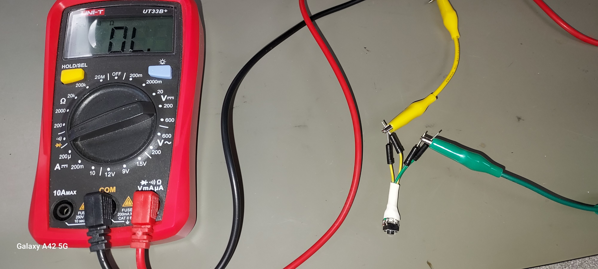

## EET103 Electrical Studies I

### [EET103](../../) - [Labs](../) - Continuity Testing

#### Objectives

- Initialize and power a digital multimeter (DMM)  
- Perform a continuity check  
- Define an open / short circuit  
- Demonstrate continuity tests using fuse and SPDT switch  

---

#### Materials

- Digital multimeter (DMM)  
- Fuse  
- DC Motor  
- Pushbutton switch  
- SPDT toggle switch  
- Soldering kit from student kit  
- Solderless jumper wires  
- Alligator clips or other part holder  
- Wire strippers  

---

### Continuity Demonstration

Follow along with the instructor as they demonstrate using the DMM to test continuity.

---

### Soldering Demonstration

Follow along with the instructor as they demonstrate soldering techniques for:  
1. Splicing two wires ([example video](https://www.youtube.com/watch?v=FTL_VCvkXrg){:target="_blank"}).  
2. Joining a test lead to a terminal.  

---

## Part 1 – Continuity Testing

**⚠️ Safety Reminder:** Circuits must be *de-energized* before performing a continuity check.  

1. Set the DMM to “Continuity Check” (buzzer symbol).  
2. Touch the test leads together.  
   - Expected reading: near **0 Ω**.  
   - Buzzer: **Yes**.  
   - This indicates continuity or a *short*.  
3. Hold the leads apart.  
   - Expected reading: **OL** or very high resistance.  
   - Buzzer: **No**.  
   - This indicates an *open circuit*.  
   -   
4. Brainstorm – Provide an example of a real-world situation where you expect continuity between two points.  
5. Test a fuse from your kit.  
   - *Good fuse*: near 0 Ω (continuity).  
   - *Bad fuse*: OL (open).  
6. Repeat using the “Resistance” setting.  
   - With continuity: near 0 Ω.  
   - With no continuity: OL.  
7. Locate the DC motor in your kit. Test for continuity between its terminals.  
   - Expect to see low resistance (motor windings).  
   - Discuss: Can a DMM fully determine if a motor is bad? Why or why not?  
8. Research switch types using the following AI Prompt:  

   [**AI Prompt:**] How do SPST, SPDT, and DPDT switches work? Provide comparisons and, if possible, images of their internals.  

9. Select a pushbutton switch and an SPDT toggle switch from your kit.  
10. Test continuity across their terminals. Note any challenges with the small size.  
11. To make these switches easier to handle, you will solder leads onto both the pushbutton and toggle switch.  

---

## Part 2 – Soldering and Switch Testing

**⚠️ Soldering Safety:** Always wear safety glasses, work in a well-ventilated area, and be mindful that soldering irons are hot.  

1. Research soldering techniques using this AI Prompt:  

   [**AI Prompt:**] I need to solder test leads onto the PCB terminals of a switch component. Provide an overview of basic soldering iron use and demonstrate connecting wires to circuit board terminals.  

2. Select two colors of test leads from your kit (not red or black).  
3. Cut each test lead in half. Strip insulation so that all four wires can be soldered onto the pushbutton terminals.  
   -   
4. Use your DMM to determine which pushbutton terminals are *always connected* and which are *switched on* when pressed.  
5. Solder the four test leads to the pushbutton (use green and yellow wires in this example):  
   - Green leads: always continuous.  
   - Yellow leads: always continuous.  
   - Green ↔ Yellow: continuous only when button is pressed.  
   -   

   Validate with your DMM:  
   1. Continuity between green leads.  
   2. Continuity between yellow leads.  
   3. No continuity between green/yellow when button not pressed.  
   4. Continuity between green/yellow when button pressed.  
   -    

6. Repeat the soldering/testing procedure for one large SPDT toggle switch.  
   - Use one wire color for the **common** terminal.  
   - Use a second color for the **two switched terminals**.  
   - Validate your wiring with the DMM.  

---

## Video Assessment

1. Get a document camera from class inventory and attach to your workstation.  
2. Plug in your headset.  
3. Log into MyNMC, launch Zoom, and start a Personal Meeting. Confirm:  
   - Headset working (mic + audio).  
   - Document camera working.  
4. Review video requirements in the rubric. Draft a short script if helpful.  
5. Record a video demonstrating:  
   - DMM continuity use.  
   - Soldering results.  
   - SPDT toggle switch functionality.  
6. Review your recording against the rubric checklist.  
7. Submit either:  
   - A .mp4 file, or  
   - A Zoom cloud link,  
   in the Week 2 or 3 Canvas assignment area.  

---

### Video Assessment Rubric

[Lab 01 Testing Continuity – Scoring Rubric](l01_rubric.md){:target="_blank"}  

Key categories include:  
- Correct DMM setup and use  
- Quality of solder joints  
- Accurate continuity testing of switches  
- Video clarity and completeness  

---
