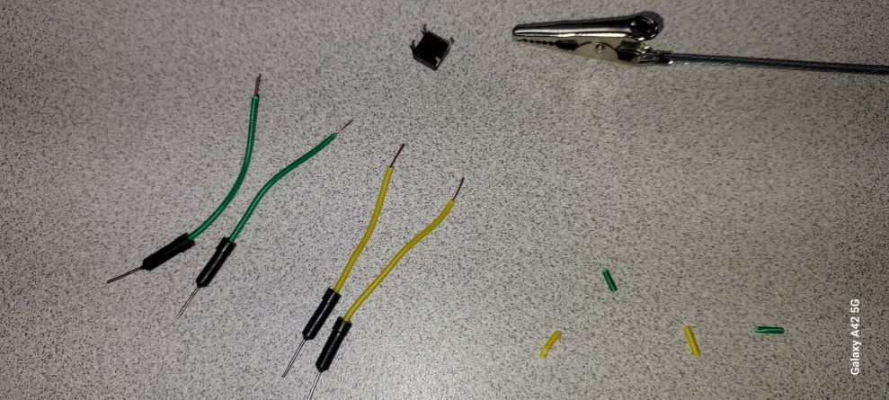
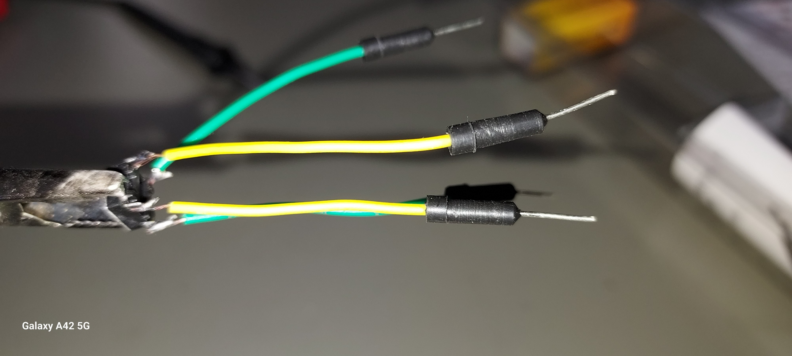
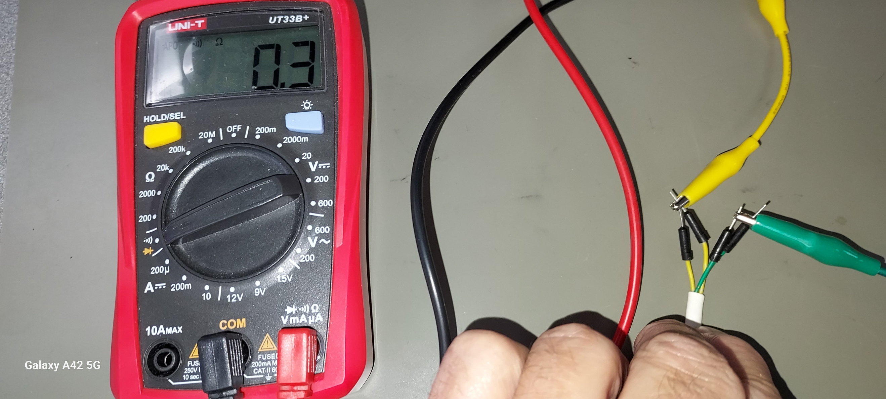

---
layout: default
---

## EET103 Electrical Studies I

### [EET103](../../) - [Labs](../) - Continuity Testing

#### Objectives: 

- Initialize and power a digital multimeter (DMM) 
- Perform a continuity check 
- Define an open / short circuit
- Demonstrate continuity tests using fuse and SPDT switch  

#### Materials: 

- Digital multimeter (DMM) 
- Fuse
- DC Motor
- Pushbutton switch
- SPDT toggle switch
- Soldering kit from student kit
- Solderless jumper wires
- Alligator clips or other part holder
- Wire strippers 

#### Continuity Demonstration

Follow along with the instructor as he or she uses the DMM to test continuity

#### Soldering Demonstration

Follow along with the instructor as he or she demonstrates soldering techniques. Be sure follow Safety procedures.
   1. splicing two wires. (see [this video](https://www.youtube.com/watch?v=FTL_VCvkXrg){:target='_blank'})
   2. joining a test lead to a terminal.

**Part 1**
1. Set the DMM to “Continuity Check”.   *WARNING – Circuits must be de-energized before performing a continuity check!*
2. Touch the leads together.
   1. What resistance does the meter display?
   1. Did the “buzzer” sound?
   1. The wires are said to have continuity between them and are electrically *shorted*.
3. Hold the leads apart.
   1. What resistance does the meter read?
   2. Did the “buzzer” sound?
   3. The wires are said to have NO continuity between them and are electrically *open* or *isolated*.
   
4. Brainstorm – Provide an example of a specific scenario when you would expect continuity between two points?
5. Using the continuity test setting, test one of your fuses from the student kit. Is it a *good* fuse? How would you know if a fuse is *bad*? 
6. Repeat a continuity test using the “Resistance” setting on the DMM. What does the meter read when connections have continuity? What does the meter read when connections do NOT have continuity?
7. Locate your DC motor in your parts kit. Use what you have learned to test for continuity inside the motor. Discuss your results with your partner. Can you determine if a DC motor is bad using a DMM?
8. Research switch types by submitting the following AI Prompt.

   [**AI Prompt:**] - How do SPST, SPDT, and DPDT switches work? Can you provide comparisons and possibly images of their internals?

9. From your student kit select one pushbutton switch and one SPDT toggle switch.
10. Use what you have learned about testing for continuity to test the switch function. Is this difficult given the small size of the components and their terminals?
11. To make the small switch components more functional for our initial tests, you will add leads to both a push button switch and a toggle switch. You will attach the leads to the devices by soldering jumper wires from your kit to the component leads.

**Part 2**

1. Research soldering techniques by submitting the following AI Prompt.

[**AI Prompt:**] - I need to solder test leads onto the PCB terminals of a switch component. Please provide an overview of basics soldering iron use along with any demonstrations of connecting wires to circuit board terminals.

2. Select two colors of test leads from your kit. Do not use red or black.
3. Cut each test lead in half. Strip the insulation on each of the four parts so that they can be soldered onto the pushbutton leads.

 

4. Use your DMM to determine with of the four terminals on the pushbutton switch are always connected and which are *switched on* when you press the button. 
5. Follow the techniques demonstrated by your instructor as well as content in the video lessons that were located by your AI prompt. Connect the **four** test leads to the pushbutton using green and yellow jumper wires from your kit. Solder connections to the four pins such that:
   1. There is always continuity between the two green leads.
   2. There is always continuity between the two yellow leads.
   3. There is only continuity between the yellow and green leads when the pushbutton is depressed.

Use the DMM to test your solder joints and switch function. Validate the following assuming you selected green and yellow leads.
   1. There is continuity between the two green leads.
   2. There is continuity between the two yellow leads.
   3. With the pushbutton **not** pressed, there is not continuity between the green and yellow leads.
   4. With the pushbutton **pressed** there is continuity between the green and yellow leads.

   

6. Based on your earlier research on switch types, specfically the SPDT toggle switch, repeat the soldering and testing procedure above for one of your kit toggle switches (use the large one).
7. Be sure you understand terminal connections and use one lead color for the common terminal and the second lead color for the two switched terminals.
8. Consider the testing requirements for this component and validate your solder joints and switch function using your DMM.

#### Video Assessment 

1. Get a document camera from the class inventory and attach to your workstation.
2. Plug in your headset.
3. Log into MyNMC, launch Zoom and then start a Personal Meeting in the Zoom app and verify that you have both the headset connected for audio and mic, and that the document camera is on and available.
4. Review the video requirements in the rubric below and plan your actions for your video production. You may want to create a simple script.
5. Record your video demonstating DMM use, soldering results, and SPDT toggle switch functionality.
6. View your final video and evaluate using the rubric. Did you include all required features? 
6. Post your video either as a .mp4 video file or as a link to the Zoom cloud in the W01 Moodle assignment area.

### Video Assessment Rubric
#### Testing Continuity

[Lab 01 Testing Continuity - Scoring Rubric](l01_rubric.pdf){:target='_blank'}