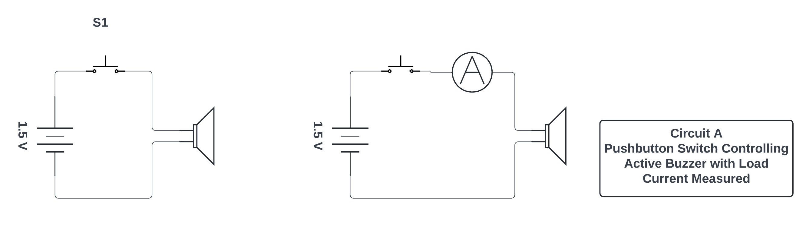
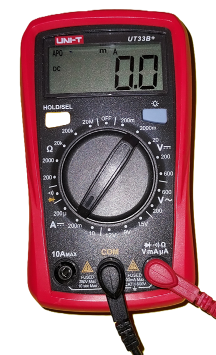
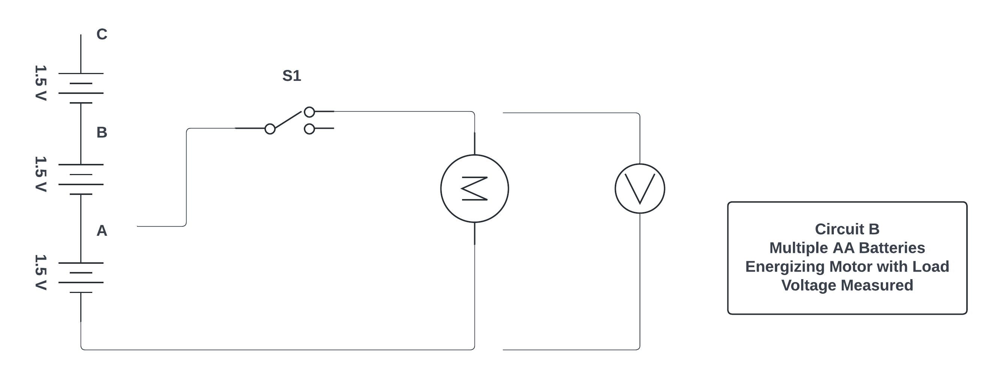
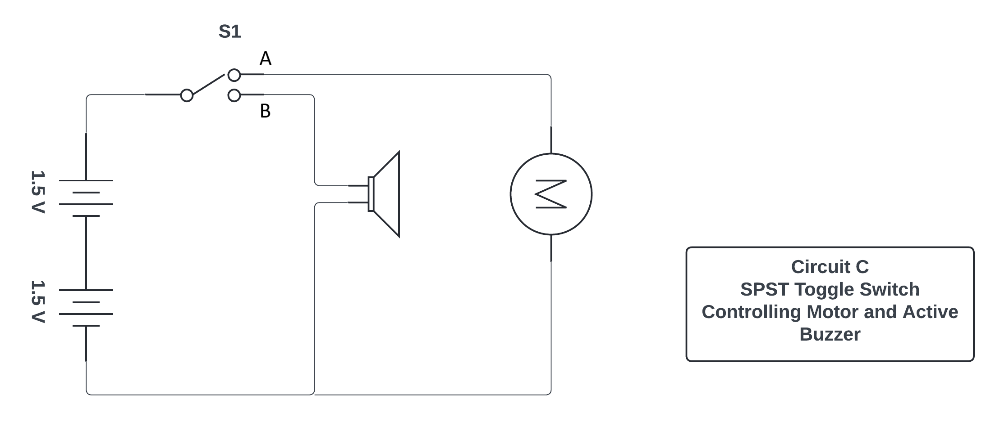

---
layout: default
---

## EET103 Electrical Studies I

### [EET103](../../) - [Labs](../) - Basic Circuits

#### Objectives: 

- Wire basic circuits by interpreting schematic diagrams
- Identify voltage sources and circuit load
- Use pushbutton and SPDT switches to control circuit operation
- Measure load current using a ammeter function of the DMM.
- Measure load voltage using the voltmeter function of the DVM.
- Demonstrate SPDT circuit operation discussing voltage sources and conventional current pathways.

#### Materials: 

- Digital multimeter (DMM) 
- AA battery holder (x3)
- AA battery (x3)
- Active buzzer (see kit inventory image)
- DC Motor
- Momentary pushbutton switch
- SPDT toggle switch
- Test leads with alligator clips

#### Demonstration - Load current and voltage using the DMM

Follow along with the instructor as he or she uses the DMM to measure both load voltage and load current.

**Part 1 - Circuit A**

1. Select the active buzzer from your parts kit. There are two buzzers provided. Use the inventory guide located in the lid of the parts kit to select the active buzzer. The instructor will explain the difference between *active* and *passive* buzzers.

2. Using the supplied battery holder and test leads, connect the 1.5V AA battery to the buzzer. Include the momentary pushbutton with leads that you constructed in Lab 1. See the schematic diagram below.

3. Test your circuit. Does the buzzer sound when the switch is depressed?

4. Next, use the DMM to measure the current draw from the battery. In this circuit the buzzer is considered the *load* in the circuit and the AA battery is considered the *source*. Note the second schematic in Circuit A shown above where an ammeter is connected in series with the load to measure load current.

   [**AI Prompt:**] - What is the typical input impedence or resistance of a digital multimeter inserted into a circuit as a ammeter to measure load current?

   [**AI Prompt:**] - What happens when the DMM is connected as an ammeter and it is mistakely connected directly across the source voltage?

8. Set your DMM to measure DC current as shown in the image below. Review the instructor's demonstration on meter use if required.

9. Depress the momentary switch. The buzzer will sound and the current flowing through this load is shown on your DMM. 

10. Create a very short video demonstrating Circuit A along with measuring its current flow. Discuss circuit construction, DMM usage including its internal resistance, and your results.

**Part 2 - Circuit B**

1. Select the dc motor from your parts kit along with three AA battery holders and batteries. You will also use the SPDT switch assembly that you created in Lab 1.

2. Using the supplied battery holders and integreted leads, connect three 1.5V AA batteries in series. See the schematic diagram below.

3. Connect one of the SPDT toggle switch terminals to the DC motor and complete the circuit by connecting the SPDT toggle switch common lead to Point A in the circuit. 

4. Test your circuit. Does the motor spin when the toggle switch is turn on? Use a small piece of tape on the motor shaft to assist with your testing.

   [**AI Prompt:**] - What is the typical input impedence or resistance of a digital multimeter inserted into a circuit as a voltmeter to measure load voltage?

   [**AI Prompt:**] - What happens when the DMM is connected as an voltmeter and it is mistakely connected in series with a load?

5. Next, use the DMM to measure the load voltage across the DC motor terminals. In this circuit the motor is considered the *load* in the circuit and the AA battery is considered the *source*. 

8. Move the common lead on the SPDT toggle switch to position B. Record your observations along with the load voltage.

8. Move the common lead on the SPDT toggle switch to position C. Record your observations along with the load voltage.

10. Create a very short video demonstrating Circuit B along with measuring load voltage. Discuss the impact on circuit voltage as batteries are added in series. What do you think will happen if the three batteries are connected in parallel rather than series?

**Part 3 - Circuit C**

1. Using the parts selected during Part 1 and Part 2, construct Circuit C shown in the schematic diagram below.

3. Review the circuit construction. How should it function or operate? Test your circuit. Was your assumption correct? Validate your build by comparing it to another class member.

5. With the switch in position A, what is the voltage across the motor? With the switch in position B, what is the voltage across the motor?

5. With the switch in position A, what is the voltage across the buzzer? With the switch in position B, what is the voltage across the buzzer?

6. Next, insert the DMM to measure the load current flowing from the batteries. Switch the toggle switch between A and B. How much current does the motor draw from the source? How much current doe the buzzer draw from the source. Which draws the higher current? Why? 

10. Create a very short video demonstrating Circuit C along with measuring load current. Discuss the impact of the two different load on load current. What load current would you expect if the switch was removed and both the buzzer and motor loads were connected together across the batteries?

### Video Assessment Rubric
#### Basic Circuits

[Lab 02 Basic Circuits - Scoring Rubric](l02_rubric.pdf){:target='_blank'}