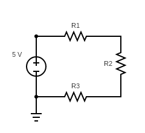
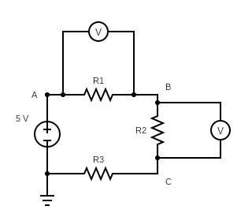
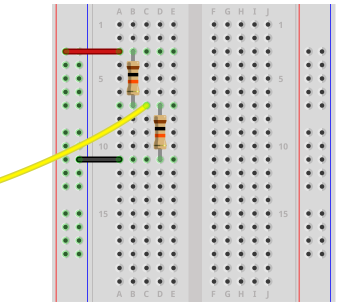

## EET103 Electrical Studies I

### [EET103](../../) - [Labs](../) - Series Circuits

Name _____________________________

Partner ____________________________

---

#### Objectives
By the end of this lab, you should be able to:
- Successfully wire and verify a three-resistor series circuit on a breadboard.  
- Interpret and follow a circuit schematic to populate a breadboard layout.  
- Confirm resistor nominal values and color codes, and measure their actual resistance with a DMM.  
- Accurately measure resistance, voltage, and current in a series circuit using a DMM.  
- Apply Ohm’s Law and Kirchhoff’s Voltage Law (KVL) to verify measured results.  

---

#### Materials
- Digital multimeter (DMM)  
- Breadboard  
- Resistors: 100 Ω, 220 Ω, 330 Ω (5% tolerance)  
- Breadboard power supply module (set to 9 V DC)  
- Test leads  
- EveryCircuit account (link and license key provided)  

> ⚠ **Safety Note:** Always confirm power supply voltage before energizing the circuit.

---

### Part 1 – Series Circuit Simulation

1. **Investigate Resistors in Series**  
   Simulate a DC circuit with three resistors connected in series using the EveryCircuit simulator.  

2. **Select Resistors**  
   Use: 100 Ω, 220 Ω, and 330 Ω.  

3. **Create an EveryCircuit Account**  
   - Link: [https://everycircuit.com/licensekeyactivation](https://everycircuit.com/licensekeyactivation){:target='_blank'}  

  
```
EveryCircuit - License key details
Organization: Northwestern Michigan College
License key: 561036398965
Term: 08/23/2025 - 12/14/2025
```


   - Simulator available at: [https://everycircuit.com/app](https://everycircuit.com/app){:target='_blank'}  
   - Note: The account expires at the end of the course.  

4. **Build the Circuit in EveryCircuit**  
   - Use the toolbar to create the circuit shown below.  
   - Include the ground symbol.  
   - Supply voltage: 9 V DC.  
   - Ensure both partners use the same resistor values and positions.  

     

5. **Simulate Circuit Operation**  
   - Press space bar to run.  
   - Observe current (same at all points in series).  
   - Observe voltage division across resistors.  

6. **Add Voltmeters**  
   Place voltmeters across R1 and R2 as shown.  

     

7. **Record Simulation Results**  

| Component | Value | Voltage Drop (V) | Current (A) |
|-----------|-------|------------------|-------------|
| R1        | 100 Ω |                  |             |
| R2        | 220 Ω |                  |             |
| R3        | 330 Ω |                  |             |

8. **Subscript Variables and Test Points**  
   - Example: V<sub>A</sub> = voltage at point A.  
   - V<sub>BC</sub>: place common lead at C, red lead at B.  

     

| Voltage Variable | Value (V) |
|------------------|-----------|
| V<sub>A</sub>     |           |
| V<sub>B</sub>     |           |
| V<sub>C</sub>     |           |
| V<sub>AB</sub>    |           |
| V<sub>BC</sub>    |           |
| V<sub>AC</sub>    |           |
| V<sub>CB</sub>    |           |

> **Check with KVL:** Confirm V<sub>AC</sub> = V<sub>AB</sub> + V<sub>BC</sub>  

---

### Part 2 – Series Circuit Construction and Measurement

1. **Inspect Resistors**  
   - Record nominal values, color codes, and measured resistance.  

| Component | Nominal Value | Color Code | Measured Value (Ω) |
|-----------|---------------|------------|--------------------|
| R1        | 100 Ω         |            |                    |
| R2        | 220 Ω         |            |                    |
| R3        | 330 Ω         |            |                    |

2. **Breadboard Overview**  
   - Watch: [How to Use a Breadboard](https://youtu.be/6WReFkfrUIk?si=2-5YteJZhcv01EYE){:target='_blank'}  
   - Watch: [Using an MB-102 Breadboard Power Supply Module](https://youtu.be/wGqubnEC-Ow?si=dtNQJz_UMcKfe5SH){:target='_blank'}  

3. **Construct the Series Circuit**  
   - Build the circuit on a breadboard.  
   - Refer to schematic and plan layout carefully.  

     

4. **Validate Circuit Build**  
   - Partner verifies circuit before applying power.  

5. **Energize and Measure**  
   - Use DMM to measure current and voltage drops.  
   - Current measured in series, voltage in parallel.  

6. **Record Your Results**  

| Component | Value | Voltage Drop (Theoretical) | Voltage Drop (Measured) | Current (Theoretical) | Current (Measured) |
|-----------|-------|----------------------------|-------------------------|-----------------------|--------------------|
| R1        | 100 Ω |                            |                         |                       |                    |
| R2        | 220 Ω |                            |                         |                       |                    |
| R3        | 330 Ω |                            |                         |                       |                    |

---

### Assessment

**Video Demonstration**  
   Create a video summarizing your work. Include:  
   - Resistor selection and schematic overview.  
   - Simulation results from Part 1 (share screen in Zoom).  
   - Breadboard build, voltage source, and current flow description.  
   - Measurement results from Part 2 compared to simulation and theoretical values. Show this document with values entered.  
   - Verification of Ohm’s Law and Kirchhoff’s Voltage Law using your measurements.  
   - Challenges encountered and lessons learned.  

- [Lab 3 Rubric](l03_rubric.md)

# EET103 – Lab 3 Video Checklist  
**Series Circuits**  

Use this checklist to make sure your video includes all required parts.  

---

### 1. Resistor Selection & Setup
- [ ] Show the three resistors (100 Ω, 220 Ω, 330 Ω).  
- [ ] Identify and explain their color codes.  
- [ ] Measure each resistor with the DMM and report the values.  

### 2. Simulation (EveryCircuit)
- [ ] Open EveryCircuit with the correct resistor values and 9 V DC source.  
- [ ] Run the simulation and show current flow.  
- [ ] Show how voltage is divided across the resistors.  
- [ ] Fill in and display the simulation results table.  

### 3. Circuit Construction
- [ ] Show your breadboard build clearly before power is applied.  
- [ ] Point out how your layout matches the schematic.  
- [ ] Confirm that your partner checked your wiring.  

### 4. Measurements
- [ ] Measure the voltage drop across each resistor with the DMM.  
- [ ] Measure the total circuit current.  
- [ ] Fill in and display the measurement results table.  

### 5. Reflection
- [ ] Describe any challenges you encountered (e.g., wiring issues, measurement errors).  
- [ ] Share what you learned about series circuits from this lab.  

---
