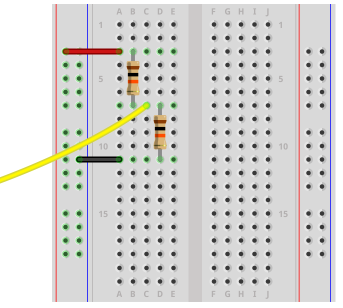

# Lab 3 - Series Circuits

## Objectives:
•	wire a series circuit using a breadboard and three resistors. 
•	Wire and populate board according to circuit schematic
•	Confirm resistor is within specification
•	Measure resistance, voltage, and current with DMM

## Procedure

You will complete the lab with a partner but each will record his or her own video presenting both the procedures and results.

### Part 1 - Series Circuit Investigation and Simulation
1. Your first task is to investigate the function of resistors in series by simulating a DC circuit with three resistors connected in series.0 
2. Select three resistors from your parts kit. The resistors must each be a different value but must also be close in range, for example 100, 220, and 330 Ohms.
3. You will use the EveryCircuit simulator during this class and you need to create a student account on this site. Use the following link and license key to create your account.
    - [https://everycircuit.com/licensekeyactivation](https://everycircuit.com/licensekeyactivation){:target='_blank'}
    - The license key is 384186293328
    - Once you've created your account, the simulator is available at [https://everycircuit.com/app](https://everycircuit.com/app){:target='_blank'}
    - You account will expire at the end of this class.
4. With the EveryCircuit app open, work with your partner to create the series circuit shown below. Be sure that you both select the same three resistors from your kit and that the location of each resistor in the circuit is the same. You will be comparing your results.
    - Note the ground symbol. This is required for the simulation to function.
    - Click on icons in the upper tool bar to add to the design surface and then drag into position.
    - Add wires between components by clicking on terminals. This will take a little practice.
    - Use the wrench icon in the lower toolbar to adjust values. A wheel interface is used to set values. Again, you will need to practice with the element.

    

5. When the circuit build is completed in the simulation editor, press the space bar to simulate ciruit function. Current flow and voltage levels are displayed.
6. Use the pause and the rewind buttons on the bottom toolbar to return to edit mode.
7. Add voltmeters across both R1 and R2 as shown in the schematic below.

    

8. Record the results of your circuit simulation in the table below. 

| Component | Value | Voltage Drop | Current |
|-----------|-----------|-----------|-----------|
| R1        |       |       |       |
| R2        |       |       |       |
| R3        |       |       |       |

9. When specifying voltages in a circuit subscripts are used. A voltage level specified as VA represents the voltage level at point A with respect to ground. If two subscripts are used, then the value represents the value at the first point in the circuits with 'respect' the the second point in the circuit. For example VBC is the voltage at point B with respect to point C. When measuring this, you will put the common lead of the voltmeter at point C and the red test lead at point B.
10. Test points A, B, and C are added to your circuit in the diagram below. Use the information on subscripted variables to complete the following table. (Consider the last one carefully)
    

| Voltage variable | Value (V) |
|-----------|-----------|
| VA |       |
| VB |       |
| VC |       |
| VAB |       |
| VBC |       |
| VAC |       |
| VCB |       |

### Part 2 - Series Circuit Construction and Measurement

1. Inspect the three resistors that you selected in part 1. Complete the following actions and record your findings in the table provided.
    -  Enter the resistor values that you selected.
    -  Use an AI prompt to determine the color code for each resistor. Enter the respective color code for each. Can you read the color code of the resistors provided?
    - Use the DMM to measure the resistance of each and record your results.
    - Compare your results with your partner. 

| Component | Nominal Value | Color Code | Measured Value |
|-----------|-----------|-----------|-----------|
| R1        |       |       |       |
| R2        |       |       |       |
| R3        |       |       |       |
 

2. View the following video to review the construction and use of a solderless breadboard
    - [How to Use a Breadboard](https://youtu.be/6WReFkfrUIk?si=2-5YteJZhcv01EYE){:target='_blank'}
2. View the following video for an overview, installation, and use of the breadboard power supply provided in your student kit.
    - [Using an MB-102 Breadboard Power Supply Module](https://youtu.be/wGqubnEC-Ow?si=dtNQJz_UMcKfe5SH){:target='_blank'}
3. With your partner, review the content of each video and check each other for understanding. Assist each other as you install the power supply onto your breadboad.
4. Using the breadboard, construct the series circuit that you simulated in Part 1 of this activity. Discuss componenet layout with your partner. A two resistor layout is shown as an example below.

    

5. Do not apply power to your circuit until your partner has reviewed and validated your circuit build.

6. Energize the circuit and measure the circuit current and voltage drops using your DMM. Recall from prior lessons that the ammeter must be inserted *in series* with the load while voltage is measured *across* or *in parallel* with the load.

8. Record your results in the table below. Validate your measurements by comparing to the circuit simulation of Part 1

| Component | Value | Voltage Drop | Current |
|-----------|-----------|-----------|-----------|
| R1        |       |       |       |
| R2        |       |       |       |
| R3        |       |       |       |

### Assessment
1. Create a video demonstrating your knowledge and capabilities. Use the following list as a guide when creating the evaluation video.
    - Discuss resistor selection and circuit schematic.
    - Review simulation results. Can you use the screen share feature in Zoom to show the EveryCircuit simulation running?
    - Show your circuit build usig the breadboard and discuss circuit construction including voltage source and current flow.
    - Discuss your measurements recorded in Part 2. Are your actual values confirmed by the circuit simulation in Part 1.
    - Discuss any challenges with this lab or additional lessons learned.  
