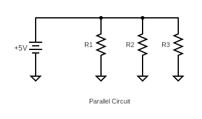
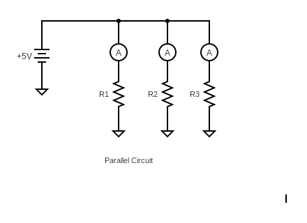

Here's a draft for Lab 4 on parallel circuits based on the format of Lab 3. This version emphasizes parallel resistance, branch currents, and power dissipation calculations.

---

## EET103 Electrical Studies I

### [EET103](../../) - [Labs](../) - Parallel Circuits

Name _____________________________

Partner ____________________________

#### Objectives: 
- Wire a parallel circuit using a breadboard and three resistors.
- Interpret and follow a circuit schematic to populate a breadboard.
- Confirm resistor values using the DMM.
- Measure resistance, voltage, current, and power dissipation using the DMM.

#### Materials: 
- Digital multimeter (DMM)
- Breadboard
- Resistors (3 different values)
- Power supply (Breadboard power supply module)
- Test leads
- EveryCircuit account (license key provided in prior lab)

#### Procedure

This lab will be completed with a partner. However, each student will create their own video presentation, demonstrating the procedures and results.

### Part 1 - Parallel Circuit Simulation

1. **Investigate Resistors in Parallel**: Simulate a DC circuit with three resistors connected in parallel using the EveryCircuit simulator.
   
2. **Select Resistors**: Choose three resistors from your kit with different values but similar ranges (e.g., 100Ω, 220Ω, and 330Ω).

4. **Build the Circuit in EveryCircuit**:
   - Use your EveryCircuit account created in the prior lab to simulate a parallel circuit using the resistors selected above.
     - Simulator available at: [https://everycircuit.com/app](https://everycircuit.com/app){:target='_blank'}
   - Use the components in the toolbar to create the parallel circuit shown below. Be sure you and your partner use the same resistors in the same locations in the circuit.
   - Add wires by clicking on terminals and dragging them to connect components.
   - Use the wrench icon to adjust the resistor values.
   - Ensure the ground symbol is included for proper simulation.

    

5. **Simulate Circuit Operation**:
   - Press the space bar to run the simulation and observe current flow and voltage levels.
   - Use the pause and rewind buttons to stop and edit the circuit.

6. **Add Ammeters**: Add ammeters in series with each resistor to observe the branch currents.

    

7. **Record Simulation Results**: Document the current through each branch, the total current, and voltage across each resistor in the table below.

| Component | Value | Branch Current | Voltage Drop |
|-----------|-------|----------------|--------------|
| R1        |       |                |              |
| R2        |       |                |              |
| R3        |       |                |              |
| Total     |       |                |              |

8. **Calculate Power Dissipation**:
   - Use the formula ( P = I<super>2</super> x R ) for each branch to calculate power dissipation and record the values.

| Component | Branch Current | Resistance | Power Dissipation |
|-----------|----------------|------------|-------------------|
| R1        |                |            |                   |
| R2        |                |            |                   |
| R3        |                |            |                   |

### Part 2 - Parallel Circuit Construction and Measurement

1. **Inspect Resistors**: Examine the three resistors selected in Part 1.
   - Record their nominal values.
   - Use an AI prompt or manual reference to determine the color code for each resistor.
   - Measure the actual resistance using the DMM.

| Component | Nominal Value | Color Code | Measured Value |
|-----------|---------------|------------|----------------|
| R1        |               |            |                |
| R2        |               |            |                |
| R3        |               |            |                |

3. **Construct the Parallel Circuit**:
   - Use your knowledge of "breadboarding" from the pior lab to build the parallel circuit from Part 1 on a breadboard. Refer to the schematic and plan component layout carefully. Have your partner review prior to energizing your circuit

    

5. **Energize and Measure**:
   - Use the DMM to measure the circuit’s total current and the branch currents through each resistor. Measure voltage across each resistor to confirm they are the same.
   - Measure power dissipation by calculating P = I<super>2</super> x R or using the  P = V x I formula for each branch.

6. **Record Your Results**:

| Component | Value | Branch Current | Voltage Drop | Power Dissipation |
|-----------|-------|----------------|--------------|-------------------|
| R1        |       |                |              |                   |
| R2        |       |                |              |                   |
| R3        |       |                |              |                   |
| Total     |       |                |              |                   |

### Assessment

1. **Video Demonstration**:
   - Create a video summarizing your lab activity. Include the following points:
     - Resistor selection and schematic overview.
     - Simulation results from Part 1 (screen-sharing the EveryCircuit app is encouraged).
     - Breadboard circuit build and description of voltage source and current flow.
     - Discussion of your measurements from Part 2, comparing them to the simulation results. Show this document with values entered.
     - Power dissipation calculations and discussion of the relationship between current and power in each branch. Which values of resistance dissipated the most power?
     - Challenges encountered during the lab and lessons learned.

