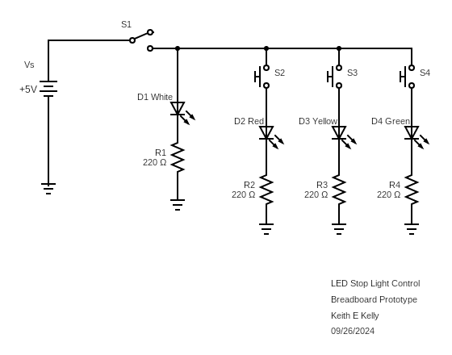
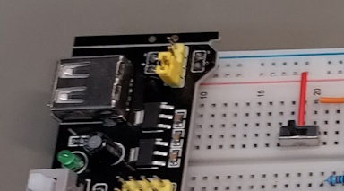
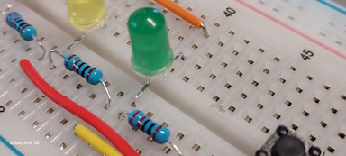
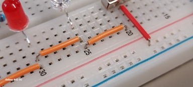
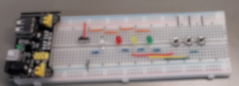

## EET103 Electrical Studies I

### [EET103](../../) - [Labs](../) - Stop Light Control Labs

### Lab 5: Stop Light Breadboarding

Name _____________________________

Partner ____________________________

#### Objectives:
1. Investigate the voltage drop and current requirements of Light Emitting Diodes (LEDs).
2. Construct a series-parallel circuit on a breadboard using LEDs, resistors, and switches to simulate Stop Light control.
3. Demonstrate professional-level breadboarding skills, including organized component layout, trimmed leads, flat wiring, and appropriate color coding for power, ground, and signal paths.
4. Validate the functionality of the Stop Light circuit, ensuring correct operation of switches and LEDs.
5. Conduct a peer review by assessing your build and a teammate’s build against the provided rubric, focusing on circuit functionality and professional presentation.

#### Materials: 
- Digital multimeter (DMM)
- Breadboard with integrated power supply
- SPDT toggle switch
- Momentary pushbutton switch (x3)
- White LED
- Red, Yellow, and Green LEDs
- Current limiting resistors (x4)
- Connection wire
- [EveryCircuit](https://everycircuit.com) student account

### Part 1 - Stop Light Circuit Investigation

1. **Investigate the Circuit in EveryCircuit**:
   - Use the provided EveryCircuit link to explore the Stop Light project:
     
     [https://everycircuit.com/circuit/5026351740092416](https://everycircuit.com/circuit/5026351740092416)

   - **Purpose of S1 and D1**: 
      - **S1 (Toggle Switch)**: S1 is used to control the power to the Stop Light circuit. When toggled, it applies voltage to the three parallel LED "legs," each consisting of a momentary pushbutton switch, an LED (red, yellow, or green), and a current limiting resistor. S1 acts as the circuit’s main power switch, effectively turning the Stop Light system on and off. 
      - **D1 (White LED)**: D1 serves as a power indicator. When S1 is toggled on, D1 lights up, showing that power is applied to the circuit. This provides a clear visual cue that the circuit is energized. 
      - **Switched Power**: The connection leaving S1, referred to as "switched power," supplies power to the rest of the circuit. This point can be used as a test point to confirm power distribution when troubleshooting or validating circuit operation.

   - **Student Prompt**:
     - Consider why having a dedicated power switch (S1) and a power indicator (D1) is valuable in circuit design. How does D1 help in troubleshooting the circuit, and why is the concept of "switched power" important when testing the Stop Light circuit?

2. **Understanding LED Characteristics**:
   - Visit [this LED basics guide](https://www.baldengineer.com/led-basics.html) to learn about LED forward voltage and current behavior. Note that typical LEDs have a forward voltage drop around 1.5V and operate between 10-20 mA.

3. **Initial Circuit Analysis with 220 Ohm Resistor (R1)**:
   - Ensure S1 (the toggle switch) is in the closed position to activate the "switched power" in the circuit. This will illuminate D1, the white LED, which acts as the power indicator for the circuit.
   - To investigate the red, yellow, and green LEDs, press the corresponding momentary switches: S2 energizes the red LED leg, S3 energizes the yellow LED leg, and S4 energizes the green LED leg. Note that all LEDs are powered by the same voltage source and have identical 220 ohm current limiting resistors.
   - Since the circuit design and resistor values are the same for each LED, the current flow and voltage drops across the red, yellow, and green LEDs will be consistent. Thus, detailed measurements are not needed for each LED leg.

   - **Focus on S1 and D1 (White LED) for Current Limiting Investigation**:
     - Close S1 to energize D1 and observe the current flow and voltage drop across D1 (the white LED) using the simulation. These values will represent the behavior of the LEDs when operating with the 220 ohm resistor.
     - Record your observations for D1 in the table below to set up the next step, where you will change R1 to a 470 ohm resistor and compare the results.

   - **Record Your Observations**:
     - Use the table to document the voltage drop and current for D1 with the 220 ohm resistor.

| Resistor Value (R1) | Voltage Drop Across D1 (V) | Current Through D1 (mA) |
|---------------------|----------------------------|-------------------------|
| 220 Ohms            |                            |                         |

4. **Change the Current Limiting Resistor (R1) to 470 Ohms**:
   - After recording your initial observations with the 220 ohm resistor, change R1 (the current limiting resistor for D1, the white LED) to 470 ohms in the EveryCircuit simulation.
   - Close S1 to apply "switched power" to the circuit, which will illuminate D1. Observe the new current flow and voltage drop across D1 with the adjusted resistor value.
   - Record the observed voltage drop across D1 and the current flowing through it in the table below.

   - **Record Your Observations**:
     - Complete the table with the new values for D1 when R1 is set to 470 ohms.

| Resistor Value (R1) | Voltage Drop Across D1 (V) | Current Through D1 (mA) |
|---------------------|----------------------------|-------------------------|
| 220 Ohms            |                            |                         |
| 470 Ohms            |                            |                         |

   - **Discussion Prompt**:
     - Compare the recorded values for the 220 ohm and 470 ohm resistors. How did increasing the resistance affect the current through D1 and its brightness? Discuss why changing the current limiting resistor is important for controlling LED operation and protecting the device.

### Part 2 - Breadboard Circuit Construction

1. **Build the Stop Light Circuit**:
   - **Position the Power Switch (S1)**:
     - Place S1 (toggle switch) in the upper left section of the breadboard to facilitate circuit organization. Ensure that S1 is positioned so that the toggle slider points right when in the “on” position.

      
      ##### Figure 1: Stop Light Power Switch

   - **Connect Power Supply Rail to S1**:
     - Connect the breadboard’s power supply rail to S1, ensuring a stable power connection. Double-check that S1 receives power directly from the 5V rail.

   - **Distribute “Switched Power”**:
     - Route the switched power from S1 to the three LED legs. Verify that the power is correctly distributed to each LED leg, consisting of the momentary switch, LED, and current limiting resistor.

   - **Arrange and Prepare LEDs**:
      - Position LEDs with the white power indicator (D1) on the left and the Stop Light LEDs to the right, arranged in red, yellow, and green order. Trim and bend the LED leads so that each LED sits flush with the breadboard. Refer to Figure 2 for correct positioning.

      
      ##### Figure 2: Component Placement

   - **Place and Prepare Resistors**:
     - Place the current limiting resistors adjacent to each LED. Cut and bend the resistor leads so that they are flush to the breadboard. Ensure that the resistors are oriented consistently, with the Red-Red bands facing left (if horizontal) or toward the top (if vertical). Refer to Figure 2.

   - **Position Momentary Switches**:
     - Place the momentary switches (S2, S3, S4) in alignment with the corresponding LEDs (red, yellow, green). Ensure that each switch controls the appropriate LED leg.

   - **Use Appropriate Wire Colors**:
     - Use the correct wire colors: red for power, black for ground, and appropriate signal colors for control lines. Ensure wiring is neat, flat against the breadboard, and follows a logical path. Refer to Figure 3 for sample wire color and placement standards. 

      
      ##### Figure 3: Wire Color and Placement

   - **Check Circuit Flow and Layout**:
     - Ensure the overall circuit layout maintains a clear flow from top-to-bottom and left-to-right. All components should be organized, with connections neatly routed to prevent overlapping or tangled wires. The image of Figure 4 is provided as an example. You are expected to create your own circuit design. A copy of the following is not appropriate.

      
      ##### Figure 4: Sample Layout and Construction

   - **Functionality Check**:
     - Verify that S1 functions as a power switch and that D1 lights up as a power indicator when S1 is toggled on. Test each momentary switch (S2, S3, S4) to confirm that they correctly energize the red, yellow, and green LEDs.

   - **Document Your Build**:
     - Use the provided rubric to assess your build quality. Check each requirement to ensure your circuit meets the expected professional standards before submitting your work for peer and instructor evaluation.

2. **Troubleshoot and Refine**:
   - If the circuit does not behave as expected, use your DMM to identify potential errors, correct them, and retest until the circuit operates correctly.

3. **Conduct a Peer Review**:
   - Review a partner’s breadboard build using the provided rubric. Provide feedback on component placement, wiring neatness, and circuit functionality.

4. **Final Check**:
   - Have the instructor provide a final review and validation. He or she will complete the checkoffs in the last column of the rubric.

---

**Create a Video Presentation**:
- Summarize your lab activity in a video, covering the following key elements:
  - **Circuit Construction Process**: Explain how you built the Stop Light circuit, highlighting your approach to meeting the professional breadboarding standards.
  - **Testing and Measurements**: Demonstrate the functionality of your circuit, including how you tested each switch and LED. Show measurements taken with the DMM to validate your circuit's operation.
  - **Peer Review Feedback**: Discuss the feedback you received during the peer review process and any adjustments you made based on that feedback.
- **Rubric Demonstration**:
  - Refer to the "Rubric Table for Breadboard Build Assessment" during your video. Highlight specific sections of the rubric, showing how your circuit meets each requirement.
  - Provide close-up views or explanations for key features, such as component layout, wiring quality, and switch functionality, to clearly demonstrate that your build aligns with the checklist criteria.

### Rubric Table for Breadboard Build Assessment:

| **Requirement**                                         | **Student Check** | **Peer Review** | **Instructor Review** |
|---------------------------------------------------------|-------------------|-----------------|-----------------------|
| Power supply rail provides power to S1                  | ☐                 | ☐               | ☐                     |
| S1 positioned in upper left of breadboard               | ☐                 | ☐               | ☐                     |
| "Switched power" distributed correctly                  | ☐                 | ☐               | ☐                     |
| S1 toggle orientation (on = right)                      | ☐                 | ☐               | ☐                     |
| LEDs flush to breadboard; leads trimmed                 | ☐                 | ☐               | ☐                     |
| LEDs positioned with correct sequence                   | ☐                 | ☐               | ☐                     |
| Resistors flush; consistent band orientation            | ☐                 | ☐               | ☐                     |
| Momentary switches aligned with LED layout              | ☐                 | ☐               | ☐                     |
| Correct wire colors used for power, ground, and control | ☐                 | ☐               | ☐                     |
| S1 and D1 functional                                    | ☐                 | ☐               | ☐                     |
| Momentary switches functional (S2, S3, S4)              | ☐                 | ☐               | ☐                     |
| Circuit flow is top-to-bottom, left-to-right            | ☐                 | ☐               | ☐                     |

