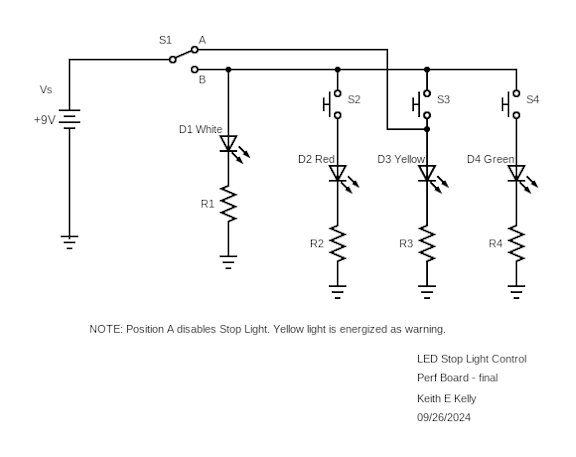
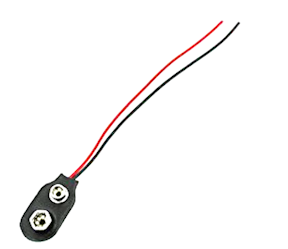
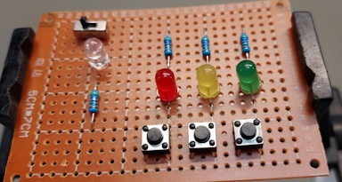
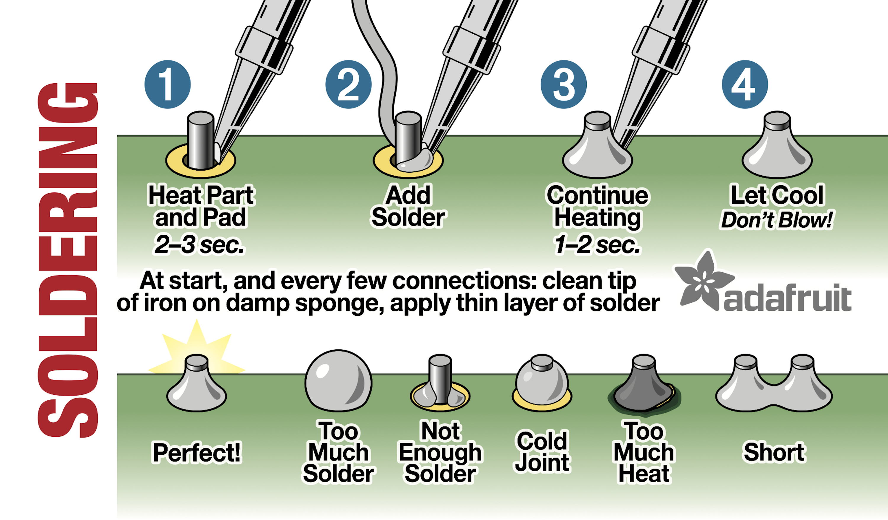
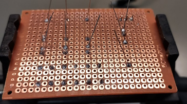
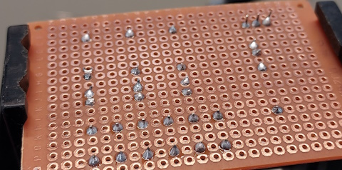
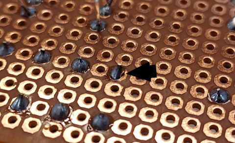
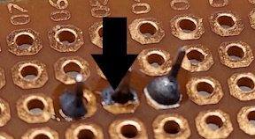

## EET103 Electrical Studies I

### [EET103](../../) - [Labs](../) - Stop Light Control Labs

### Lab 5: Stop Light Perfboard Build

Name _____________________________

Partner ____________________________

#### Objectives:
1. Transfer the Stop Light circuit from a breadboard to a perfboard, maintaining logical component layout.
2. Demonstrate professional-level point-to-point soldering skills, ensuring secure and reliable connections.
3. Validate the functionality of the Stop Light circuit on the perfboard, ensuring correct operation of switches and LEDs.
4. Conduct a peer review by assessing your build and a teammate’s build against the provided rubric, focusing on circuit functionality, solder quality, and layout organization.

#### Materials: 
- Completed breadboard circuit from Lab 4
- Perforated board (perfboard)
- Soldering iron and solder
- Wire cutters and needle-nose pliers
- SPDT toggle switch
- Momentary pushbutton switch (x3)
- White LED
- Red, Yellow, and Green LEDs
- Current limiting resistors (x4)
- Connection wire
- 9 volt battery clip
- 9 volt battery

### Procedure

### Part 1 - Revised Stop Light Circuit Investigation

1. **Revised Stop Light Circuit.

   - The Stop Light Control circuit from the prior lab has been modified to support the use of a 9 volt battery as a source. The revised schematic is below. 

   
   ##### Figure 1: Revised Stop Light Control Circuit
   
   - Note the 9V source. For this circuit the 9V battery supplied in your kit will be connected directly to the control circuit using the connect below. This additional connect is provided by the instructor and *is not* the connector with the attached barrel connector that was provided in your student kit.

   
   ##### Figure 2: Additional 9V Connector

   - Due to the increase voltage source the current limiting resistor values must also be updated. Use what you learned from the prior lab to determine a new value for the required resistors. Refer to your student kit inventory and select the most appropriate value based on your understanding and calculations.

   - Also note the addition of the additional of the connection the cause the yellow LED to be energized anytime the control systems is "turn off".
   

2. **Review Your Breadboard Circuit**:
   - Begin by reviewing the completed Stop Light breadboard circuit from Lab 4. Take note of component positions, wiring paths, and overall circuit flow. Be sure all lab checks are complete. You will be using component in the perfboard build.

2. **Design the Perfboard Layout**:
   - Plan the placement of components on the perfboard to maintain a logical flow similar to your breadboard build. Keep components organized from top-to-bottom and left-to-right. Replace the 220 ohm resistor used on the breadboard with your new values determined in Part 1.

   - **Position Components Thoughtfully**: Ensure that components are spaced appropriately to allow easy access for soldering and troubleshooting. Refer to Figure 1 for an example of component positioning.

   
    ##### Figure 3: Example Perfboard Layout

3. **Mark Component Positions**:
   - Use a marker to outline where each component will be placed on the perfboard. Ensure that connections mirror your breadboard design to maintain circuit integrity.

4. **Insert Components**:
   - Carefully insert each component into the perfboard according to your layout plan. Keep components flush with the board and align the orientation of LEDs, resistors, and switches as shown in Figure 3.

### Part 2 - Soldering the Circuit

1. **Prepare to Solder**:
   - Ensure your soldering iron is clean and heated to the correct temperature. Use proper safety precautions, including working in a well-ventilated area. You must wear safety glasses!

2. **Solder Components to the Perfboard**:
   - Begin by soldering components in place, starting with the lowest profile components (resistors) and working towards the taller components (LEDs, switches).
   - Review this instructional diagram from Adafruit.

   
   ##### Figure 4: Adafruit Component Soldering

   - Be sure components remain flush to the board as your rotate the board to solder connection on the bottom. PCB vises are available and recommended. Spreading component leads will secure. Taping the top of the board is one option for components that move.

   
    ##### Figure 5: Component Soldering

   - Clip excess leads as required. The following image shows components installed and a board ready for point-to-point solder connections.
   
   
   ##### Figure 6: Component Soldering Completed

3. **Check Solder Joints**:
   - Inspect each solder joint to ensure it is clean, shiny, and free of cold solder joints or bridges. Rework any solder joints that do not meet these criteria. Examples of a bad solder joints are shown below.

    
    
   ##### Figure 7: Insufficient Solder

   - Use point-to-point soldering techniques, connecting each component leg directly to the next without excessive wire length. Use heat shrink tubing where necessary to insulate connections. Refer to Figure 3 for good soldering techniques.

    
    ##### Figure 3: Point-to-Point Soldering Technique

4. **Connect Switches and LEDs**:
   - Solder connections for the SPDT toggle switch (S1) and momentary pushbutton switches (S2, S3, S4), ensuring that the correct LED (red, yellow, or green) is energized when each switch is pressed.

5. **Create "Switched Power" Path**:
   - Recreate the "switched power" path from S1 to the LED legs as designed in your breadboard layout, ensuring the path is clean and follows logical routing.

### Part 3 - Final Validation and Review

1. **Functionality Check**:
   - Power the perfboard circuit and test the operation of each switch and LED. Ensure that S1 toggles the power correctly and D1 (the white LED) functions as the power indicator.

2. **Troubleshoot and Refine**:
   - If the circuit does not function as expected, use your DMM to check continuity, voltages, and connections. Rework any faulty solder joints or misrouted wires.

3. **Document Your Build**:
   - Take clear photos of your completed perfboard build, highlighting component placement and soldering quality. These images will be part of your submission and peer review.

4. **Conduct a Peer Review**:
   - Review a partner’s perfboard build using the provided rubric. Provide feedback on component placement, wiring neatness, soldering quality, and circuit functionality.

5. **Instructor Final Check**:
   - Have the instructor review your build for final validation. The instructor will complete the checkoffs in the last column of the rubric.

---

**Create a Video Presentation**:
- Summarize your lab activity in a video, covering the following key elements:
  - **Perfboard Construction Process**: Explain how you transferred the circuit from the breadboard to the perfboard, focusing on layout planning and soldering techniques.
  - **Testing and Validation**: Demonstrate the functionality of your perfboard circuit, showing how each switch and LED operates correctly.
  - **Peer Review Feedback**: Discuss the feedback received during peer review and any adjustments made based on that feedback.
- **Rubric Demonstration**:
  - Refer to the "Rubric Table for Perfboard Build Assessment" during your video. Highlight specific sections of the rubric, showing how your circuit meets each requirement.
  - Provide close-up views of solder joints, component placement, and wiring to demonstrate your build quality.

### Rubric Table for Perfboard Build Assessment:

| **Requirement**                                         | **Student Check** | **Peer Review** | **Instructor Review** |
|---------------------------------------------------------|-------------------|-----------------|-----------------------|
| Logical component placement on perfboard                | ☐                 | ☐               | ☐                     |
| Secure and clean solder joints                          | ☐                 | ☐               | ☐                     |
| Point-to-point soldering with minimal wire lengths      | ☐                 | ☐               | ☐                     |
| Correct orientation of LEDs and switches                | ☐                 | ☐               | ☐                     |
| Consistent and appropriate wire color coding            | ☐                 | ☐               | ☐                     |
| Functional "switched power" path                        | ☐                 | ☐               | ☐                     |
| All switches and LEDs operate correctly                 | ☐                 | ☐               | ☐                     |
| Overall neatness and organization                       | ☐                 | ☐               | ☐                     |
| Perfboard circuit matches breadboard layout             | ☐                 | ☐               | ☐                     |

