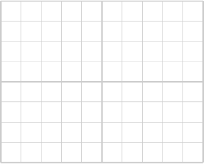

# Lab: Introduction to AC, Capacitors, and RC Circuits

## Objective
In this lab, students will explore the basics of AC signals, capacitors, and RC circuits. Through a series of introductory questions and hands-on procedures, students will reinforce their understanding of AC frequency and amplitude, observe capacitor behavior in DC and AC circuits, and investigate the concept of the RC time constant.

## Materials
- XR2206 signal generator
- Lab oscilloscope with two probes
- Breadboard
- Capacitors: .1 µF, 10 µF
- Resistors: 1K, 2K, 4.7K, 10K
- Connection wire

## Resources
- **All About Circuits** (Class Text):
  - [AC Signals and Systems](https://www.allaboutcircuits.com/textbook/alternating-current/)  
  - [Measurements of AC Magnitude](https://www.allaboutcircuits.com/textbook/alternating-current/chpt-1/measurements-ac-magnitude/)  
  - [Electric Fields and Capacitance](https://www.allaboutcircuits.com/textbook/direct-current/chpt-13/electric-fields-capacitance/)  
  - [Capacitor Transient Response](https://www.allaboutcircuits.com/textbook/direct-current/chpt-16/capacitor-transient-response/)  

- **Additional Resources**:
  - [Introduction to Alternating Current](https://www.electronics-tutorials.ws/accircuits/alternating-current.html) – Electronics Tutorials  
  - [Getting Started with Oscilloscopes](https://learn.sparkfun.com/tutorials/how-to-use-an-oscilloscope) – SparkFun  
  - [What is a Capacitor?](https://www.electronics-tutorials.ws/capacitor/cap_1.html) – Electronics Tutorials  

---

## Section 1: AC Frequency, Amplitude, and Oscilloscope Review

### 1. AC Frequency and Amplitude
   - Define **frequency** in the context of an AC signal.
   - Explain how **amplitude** is measured and what it represents on an oscilloscope.

| AC Parameters | Definition, Description, Explanation                   |
|--------------|-----------------------------------------|
| Frequency    |                                
| Amplitude    |                                

   

### 2. Oscilloscope Operations
   - Describe the steps to set up the oscilloscope to display an AC waveform.
         
   - Identify the oscilloscope controls used to adjust the **vertical (amplitude)** and **horizontal (time)** scales.
   - Explain the purpose of the **trigger function** and how it affects waveform stability on the display.
      
   - Adjust the XR2206 signal generator to produce a **500 Hz square wave**. Attempt to adjust the amplitude of the waveform. Is this possible when using the square wave output?
   - Measure and record both the **frequency** and **amplitude** on the oscilloscope.
      
    Adjust the time base so that one or two cycles are displayed.
   - **Sketch the Waveform**: Below, sketch the waveform displayed on the oscilloscope. Use the provided image as a reference for your sketch.
    
   - Have the instructor provide a lab check here.
       
      - Lab Check ________
   
    

### 3. Capacitor Basics
   - Describe a **capacitor** and its role in a circuit.
            
   - List and explain the key ratings of a capacitor, specifically **capacitance** (in farads) and **working voltage**.

| Cap Parameters  | Definition, Description, Explanation    |
|-----------------|-----------------------------------------|
| Capacitance     |                                |
| Working Voltage |                                |

   - Differentiate between **polarized** and **non-polarized** capacitors:
     - Identify at least two types of each and their typical applications.
<br         

---

## Section 2: RC Charge and Discharge

### 1. Signal Generator Setup
   - **Objective**: Set up the XR2206 signal generator to produce a **500 Hz square wave**.
   - Adjust the trigger and frequency controls to achieve a stable waveform for observing RC circuit behavior.
   - Record the generator’s frequency and amplitude settings on your oscilloscope for reference.
         

### 2. Basic Questions on Capacitor Charge in DC Circuits
   - Describe what happens to a capacitor when **DC voltage** is first applied across an RC circuit. Consider how the capacitor voltage changes over time and what ultimately happens as it charges.
             
   - Explain the role of the **resistor** in limiting the rate of capacitor charge.
             
   - Describe how current changes in the circuit as the capacitor nears the supply voltage.
            

   - **Resource**: [EveryCircuit Simulation for RC Circuit](https://everycircuit.com/circuit/5103054453735424)

### 3. RC Charge and Discharge with Square Wave Input (Procedure)
   - **Objective**: Duplicate the RC circuit shown in the [EveryCircuit Simulation](https://everycircuit.com/circuit/6541927687913472) using  **2 ms period**.
   - Components: Use a **4.7K resistor** and a **.01 µF capacitor**. (.01µF is 103 ceramic cap)
   - **Setup**: Connect the oscilloscope to display both the square wave input and the capacitor’s charge/discharge curve.
   - Observe and record the **voltage across the capacitor** as it charges and discharges with each cycle of the square wave.

### 4. Investigating the RC Time Constant (τ)
   - Vary the **resistor (R)** and **capacitor (C)** values by selecting different resistors (4.7K, 10K, 47K) and capacitors (.01 µF).
   - Record values in the following table:

| Resistor (R) | Capacitor (C) | Calculated τ (R × C) | Description of Capacitor Voltage Change |
|--------------|---------------|-----------------------|-----------------------------------------|
| 4.7K           | .01 µF         |                       |                                         |
| 10K           | .01 µF         |                       |                                         |
| 47K         | .01 µF         |                       |                                         |

### 5. Investigating the RC Time Constant (τ) with Different Capacitance Values
   - Modify the circuit by adding a second **.01 µF capacitor**:
     - **Parallel Configuration**: Place the second capacitor in parallel with the first .01 µF capacitor.
     - **Series Configuration**: Place the two .01 µF capacitors in series.
   - For each configuration, record values in the table below.

| Resistor (R) | Capacitor Configuration      | Equivalent Capacitance (C_eq) | Calculated τ (R × C_eq) | Description of Capacitor Voltage Change |
|--------------|------------------------------|-------------------------------|--------------------------|-----------------------------------------|
| 10K           | Single .01 µF                 |                               |                          |                                         |
| 10K           | Two .01 µF in Parallel        |                               |                          |                                         |
| 10K           | Two .01 µF in Series          |                               |                          |                                         |

---

## Section 3: Introduction to Low-Pass Filtering

### Low-Pass Filter Investigation

1. **Overview**
   - Investigate a **low-pass filter** circuit consisting of a **10K resistor** and **.1 µF capacitor** connected to ground (.1µF is 104).
2. **Procedure**
   - **Step 1**: Set up the low-pass filter circuit.
   - **Step 2**: Measure the **output signal across the capacitor** with a **1K Hz input frequency**.
   - **Step 3**: Increase the input frequency to **2 kHz** and note changs. 
   - **Step 4**: Add a second 1 µF capacitor in parallel. Record data below.

| Input Frequency | Capacitor Configuration      | Output Voltage (V peak-to-peak) | Observations                       |
|-----------------|------------------------------|----------------------------------|------------------------------------|
| 1 KHz          | Single 1 µF capacitor        |                                  |                                    |
| 2 kHz           | Single 1 µF capacitor        |                                  |                                    |
| 2 kHz           | Two 1 µF capacitors in parallel |                               |                                    |

---

## Section 4: Introduction to High-Pass Filtering

### High-Pass Filter Investigation

1. **Overview**
   - Explore a **high-pass filter** with a **0.1 µF capacitor** and **10K resistor**. Input is a 2V DC offset and 1 kHz, 2V peak-to-peak AC signal.
2. **Procedure**
   - **Step 1**: Investigate the high-pass filter behavior.
   - **Step 2**: Record data for **1 kHz and 10 kHz input frequencies** in the table below.

| Input Frequency | Input Amplitude (Peak-to-Peak) | Input DC Offset (V) | Output AC Voltage (V peak-to-peak) | Output DC Voltage (V) |
|-----------------|--------------------------------|----------------------|-------------------------------------|------------------------|
| 1 kHz           | 2V                             |                      |                                     | 0                      |
| 2 kHz          | 2V                             |                      |                                     | 0                      |

