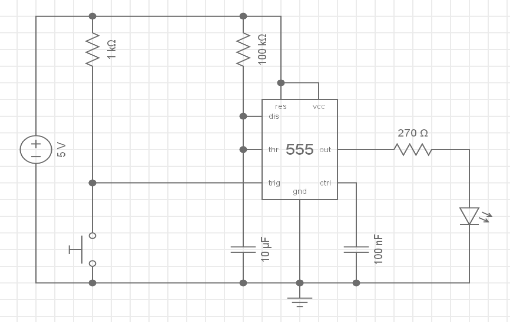
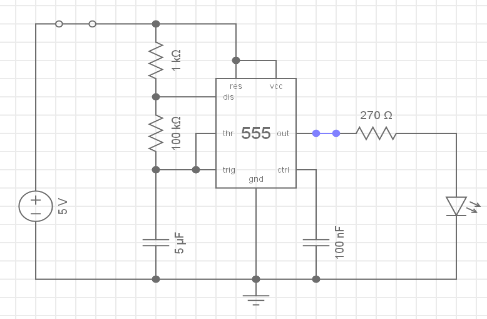

---
layout: default
---
## EET103 Electrical Studies I

### [EET103](../../) - [Labs](../) - 555 Timer

### Lab 12: 555 Timer Investigation

**Name:** _____________________________

---
## Objectives
- Review the datasheet for a 555 timer 
- Identify the pinout for the 555 timer 
- Build a monostable 555 timer circuit 
- Build an astable 555 timer circuit (oscillator) 
- Operate an oscilloscope to take measurements on the signal 

## Materials
- 555 timer
- resistors -  220 Ω, 1 kΩ, , 100 kΩ, 1 MΩ 
- capacitor, 10 μF (x2)
- capacitor, 100 nF (104)
- LED, any color
- switch, pushbutton

## Resources
- [555 Lab - Introduction to the 555 Timer IC](https://www.allaboutcircuits.com/textbook/experiments/chpt-8/555-ic/){:target='_blank'}
- [555 Lab - Monostable Multivibrator (One-shot)](https://www.allaboutcircuits.com/textbook/experiments/chpt-8/555-monostable-multivibrator/){:target='_blank'}
- [555 Timer Astable Oscillator Circuit](https://www.allaboutcircuits.com/textbook/experiments/chpt-8/cmos-555-long-duration-minimum-parts-red-led-flasher//){:target='_blank'}
- [TLC555 Data Sheet](tlc555.pdf){:target='_blank'}
- [555 Monstable simulation](https://everycircuit.com/circuit/4825134501986304){:target='_blank'}

**Section I:  Prelab (Refer to the 555 timer datasheet)** 

- Describe what an Integrated Circuit (IC) is.

      

- Refer to the data sheet provided in the Resources section to answer the following.

  - What is the recommended range for the supply voltage, VDD? (See section 5.3)

    

  - What is the maximum current that the discharge or output pins can *sink*? (See section 5.1)

    

  - What is the maximum current that the discharge or output pins can *source*? (See section 5.1)

    

  - What is the typical value for the trigger voltage with VDD at 5V? (See section 5.6)

    

  - Which package type are we using? (See Package Information and class notes)

      

- Label the following pin functions on the image of the 555 DIP package below.

  - VDD or (or VCC)
  - GND (ground)  
  - TRIG (trigger)  
  - DISCH (discharge)
  - THRES (threshold)  
  - CONT (control voltage)
  - RESET
  - OUT (output)

    

  

    

**Section II:  Monostable** 

- The following 555 circuit is for a monostable (one stable state) output.  When the switch is pressed, the time on in seconds is given by 
*TON = 1.1 ∗ RC*

  

- Calculate TON for the circuit shown above.

      

- Construct the above circuit and test it to be sure it functions as expected. (Note: substitute the 270Ω resistor with your 220Ω resistor)
  
  - Instructor sign-off ________________

- Measure TON and record it below.
  
    
  
-  Replace R with a 1 MΩ resistor.  Calculate TON.
  
     

- Measure TON and record it below.
  
    

- Are the measured TON values as expected?  If they are significantly different, double check the wiring and component values.

      

**Section III:  Astable** 

- The following 555 circuit is for an astable (no stable state) output. When powered, the operating frequency (in Hz) is calculated as follows: 

  - F = 1 / T
  - T = TON + TOFF
  - TON = 0.693 * (R1 + R2)C
  - TOFF = 0.693 * R2C

  

- Calculate the operating frequency for the circuit shown above.

      

- Construct the circuit and test it to be sure it functions as expected. (Note: Use two 10 μF capacitors in series to create the 5 μF value. Be sure to note polarity.)

  - Instructor sign-off ______________
    
- Connect the output to an oscilloscope and measure the frequency. 

    

- Replace R2 with a 10 kΩ resistor.  Calculate the new operating frequency. 

    

- Measure the operating frequency and record it below.

    

- Are the measured frequencies as expected?  If not, why? 

      

**Section IV:  Postlab** 

- List three applications for a 555 timer.

       

- How are RC time constants used to control the frequency or TON of a 555 timer circuit? 

      

- You have an application that requires an output pulse of 60 seconds.  Using a 1000 μF capacitor, calculate a resistor value that will meet the circuit requirements.

       

- You have an application that requires an operating frequency of 60 Hz.  Using R1 = 1kΩ and R2 =  100 kΩ, calculate a capacitor value that will meet the circuit requirements.

      

- If R1 = R2 = 1kΩ, and C = 5 μF, calculate the following: 

  - TON: 

  - TOFF: 

  - Frequency: 

