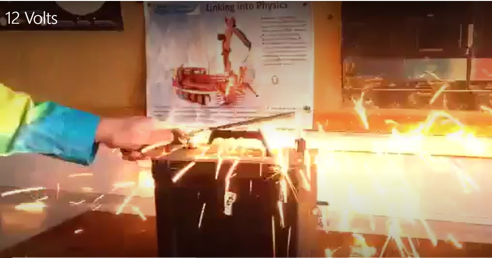
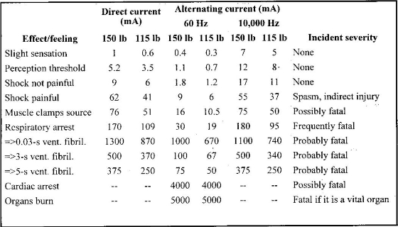
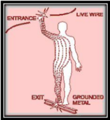
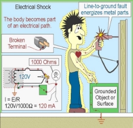
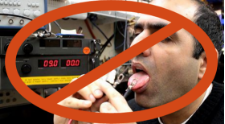
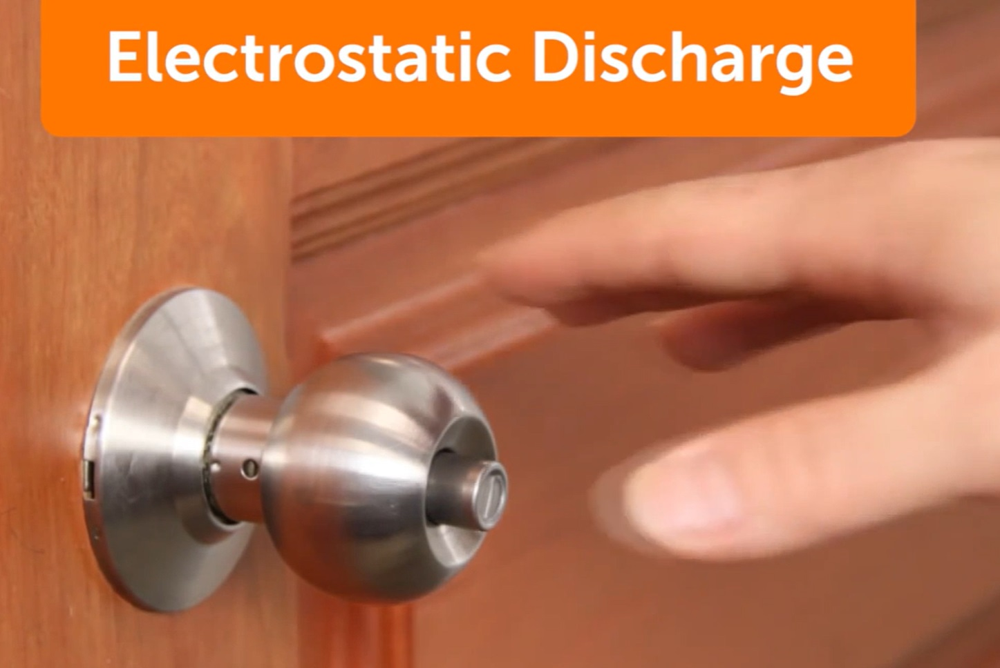
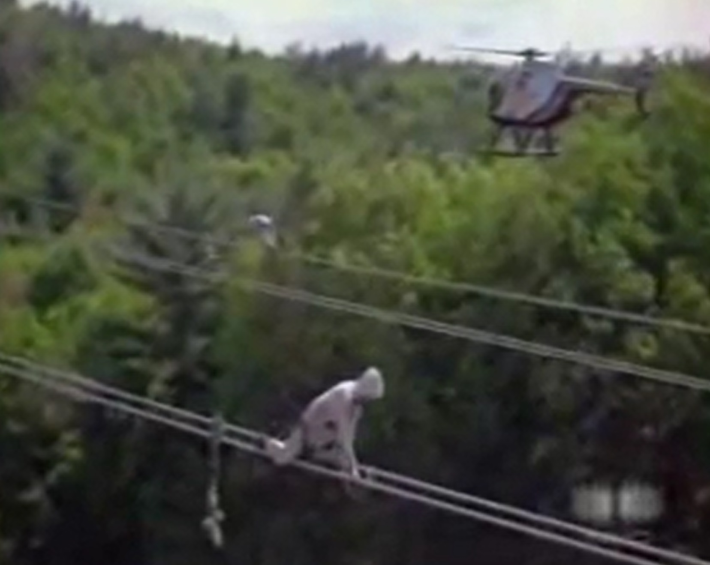

---
layout: default
---

## EET103 Electrical Studies I

### [EET103](../../) - [Lessons](../) - Electrical Safety

In future lessons, you will learn about voltage and current. As a quick introduction, you can think of voltage as the driving *force* behind the electricity, and this driving force is measured in volts. *Current* is the speed that the electrons are flowing, and current is measured in *amperes* (or *amps*). Higher current means the electrons are moving faster.

Which is more dangerous:

1. 10,000 volts
1. 12 volts

Think about it briefly, then watch the following two videos:

***10,000 Volts***

{:target='_blank'}

***12 Volts***

{:target='_blank'}

- Electric fences put out pulses of up to about 10,000 volts. In the first video, you can see that the people touching the fence were startled, but uninjured. This is because the *current* (the speed the electrons are flowing) is very small.

- Car batteries have only 12 volts, but are capable of suppling currents of 400 amps or more to start your vehicle engine (higher current means that the electrons move much faster). In the second video, the terminals of a 12-volt car battery are connected directly to a nail. This results in a very high current (probably close to 1000 amps or more). You can see that the result is heat and a melted nail.

- Which is more dangerous? Current. Just 0.2 amps can be fatal while 10,000 volts is 'fun'. The following chart (Figure 1) summarizes some effects of electrical current:

Figure 1: The effects of electrical current.

- A current of 170 milliamps (in the first column next to Respiratory arrest) is "frequently fatal". [The prefix "milli" means 1/1000, which is the same as multiplying by 0.001. 
- 170 milliamps is equal to 0.170 amps.] It is possible to have a high voltage but low current, like the electric fence, which is harmless. It is also possible to have a relatively low voltage, like the 12-volt car battery, but a high current. An example of a low voltage and low current source is a standard AA or D-cell battery. These are relatively safe.

  

Figure 2: The path of electrical current through the body is one factor that determines the severity of a shock.

**Warning:** The 120 volt electrical power that comes from a standard household outlet is dangerous and should be treated with a great deal of respect. The combination of 120 volts and current of up to 20 amps can be lethal. *Always* turn off the power before working with any household electricity!

The severity of an electrical shock depends on three things:

1. Path of the current: Electrical current that flows through your heart or central nervous system is the most dangerous.
  - Ear-to-ear
  - Left hand to right hand
  - Hand to foot
2. Amount of current: More current means more damage (like the nail in the video).
2. Duration of exposure: A longer exposure will result in greater injury.

Remember: Low voltage does not always mean low risk!

***Electronic Lab Safety Practices***

How will we be safe in the lab? Fortunately most of what we will be doing in EET103 labs will be with low power (low current & low voltage). 

Some other safe practices include:

- Safety glasses are required at all times in the lab. If you have prescription glasses, then you are ok to wear these. If you don't wear glasses, you may want to purchase your own safety glasses, otherwise you will need to wear safety glasses provided in the lab.
- Don't wear loose jewelry or clothing, especially things that hang down over the lab work space. Metal jewelry can cause problems around electrical equipment, and loose clothing or even hair can easily come in contact with soldering irons and get burned.
- Be careful with hand tools. We will be using wire cutters, screwdrivers, pliers, and voltmeters with sharp metal probes.
- No food or drinks in the lab. You may have drinks in the class area, but no food.

Some electronic components, such as microprocessors, can be damaged by electro-static discharge (static electricity), as the following video explains:

**ElectroStatic video**

{:target='_blank'}

With the right attitude and safety precautions, you *can* be safe around electricity!

**High Voltage Lineworkers video**

{:target='_blank'}
