---
layout: default
---

## EET103 Electrical Studies I

### [EET103](../../) - [Lessons](../) - Tools of the Trade

In this unit, you will learn about some of the basic tools you will need to use in the lab.

All equipment is provided in the lab. If you own your own equipment, you are allowed, and encouraged, to bring it in. If you own a multimeter but aren't sure how to use it, bring it in and we'll help you get familiar with it. Hand tools, soldering irons, electronic components, bring them in!

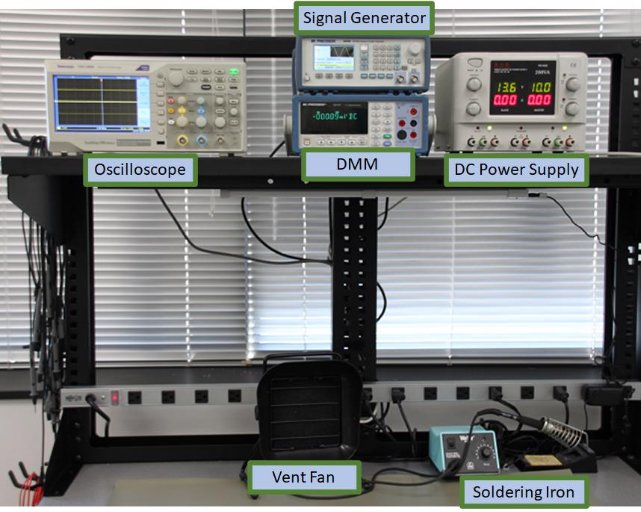

Figure 1: Lab station in PS107.

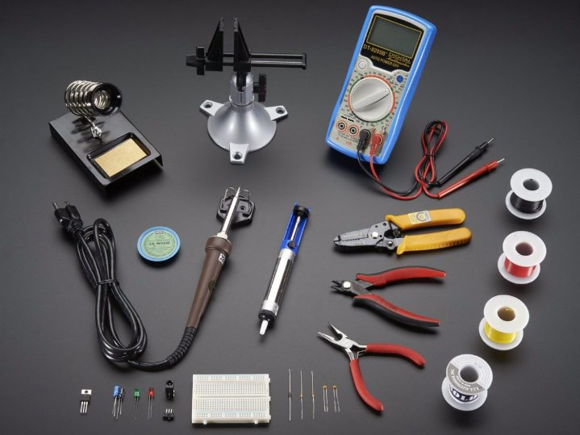

Figure 2: Basic toolkit.

Some of the tools you will be using include:

- Basic Hand Tools: Includes tools like pliers, screwdrivers, wire cutters, wire strippers, etc.
- Multimeters: We will be using digital multimeters (DMMs) in most labs. The DMM is a very useful testing device that can measure
  - Voltage (AC and DC)
  - Current (milliamps and amps)
  - Resistance (measured in ohms)

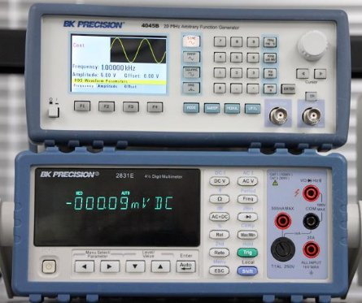

Figure 3: BK Precision Function Generator (top) and BK Precision 2831E DMM (bottom).

BK Precision 2831E Basic Operation (manual)

- Probes (one red and one black) are connected as follows:
  - The black probe connects to the COM terminal.
  - The red probe connects to the V-Ω terminal for measuring voltage or resistance, and it connects to either the 500 mA MAX or 20A probe for measuring current
- Select the appropriate mode with the button: DC V for DC voltage, shift+DC V for DC current, Ω for measuring resistance.
- Connect the probes to the circuit and observe the reading.

**BK Precisuin 2831**
[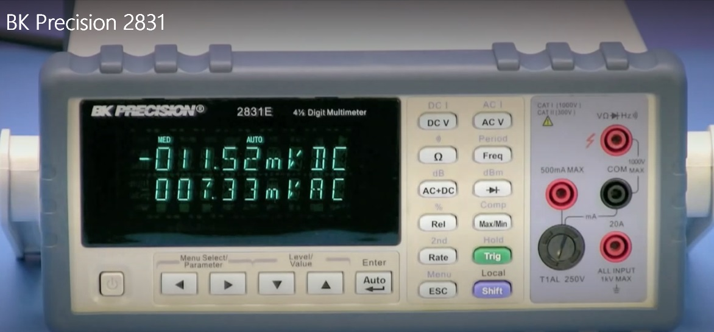](https://nmc.hosted.panopto.com/Panopto/Pages/Viewer.aspx?id=6c38ccf7-fdf3-44b1-ad43-ae5a00ca4732&instance=moodle-production){:target='_blank'}

**How to Use a Multimeter**
[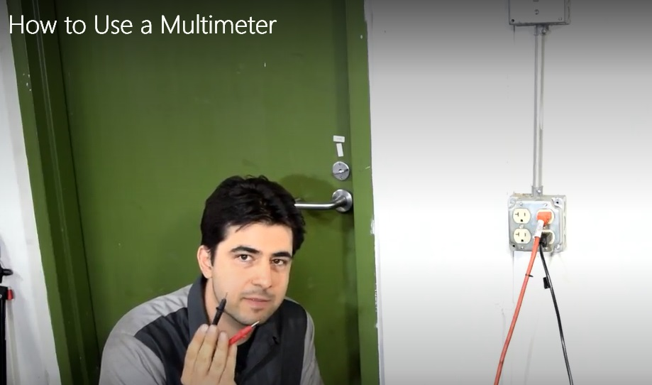 ](https://nmc.hosted.panopto.com/Panopto/Pages/Viewer.aspx?id=7d99ef9e-617f-4aa6-a686-ae5a00ca4873&instance=moodle-production){:target='_blank'}

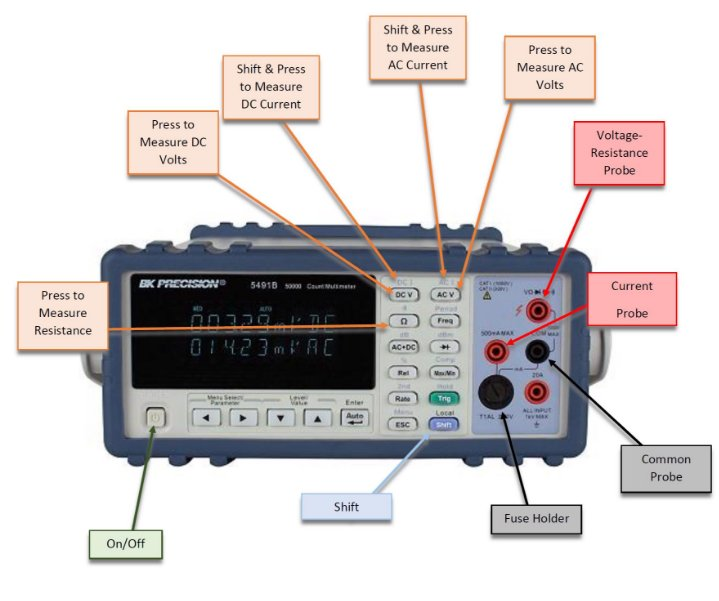

Figure 4: BK Precision DMM.

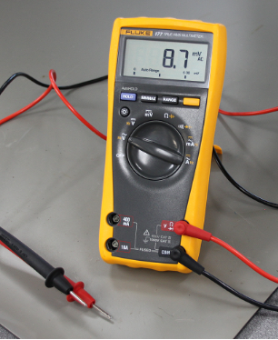

Figure 5: Fluke 177 Handheld DMM (also available for use).

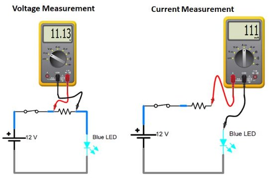

Figure 6: How to measure voltage and current.

When measuring voltage, the DMM is connected in parallel directly across the two points of measurement (see Figure 6 above). The DMM on the left shows a voltage measurement of 11.13 volts across the resistor. When measuring voltage, the DMM is designed to have a very high resistance so it doesn't affect the circuit it's connected to.

When measuring current, the DMM is connected in series with the circuit. The DMM actually becomes part of the circuit. The DMM on the right shows a current of 111 milliamps (0.111 amps) flowing through the resistor and LED. When measuring current, the DMM is designed to have a very low resistance so it doesn't affect the circuit.

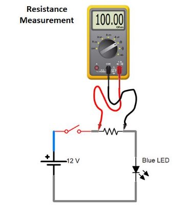

Figure 7: Measuring resistance with a DMM.

When measuring resistance, it's very important to remove power from the circuit first. The circuit above shows a resistance measurement of 100 Ω. Notice that the switch is OFF to remove power from the circuit. When measuring resistance, the DMM supplies its own power.

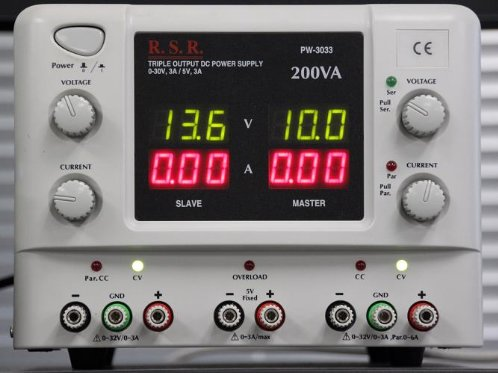

Figure 8: DC Power Supply with current limiting.

DC Power Supply Basic Operation

- Connect the negative supply output (black terminal) to the circuit using a black lead
- Set the current knob to mid range (this sets the current limit)
- Adjust the voltage knob to the desired voltage level
  - The voltage is displayed by the green numbers on the top
- Connect the positive supply output (red terminal) to the circuit using a red lead
- Observe the supply current to ensure it is at the expected value
  - The supply current is displayed by the red numbers on the bottom
  - Excessive current can indicate a short, which may trigger the overload protection and shut off the power output

**Over Current Protection** (current limiting)
[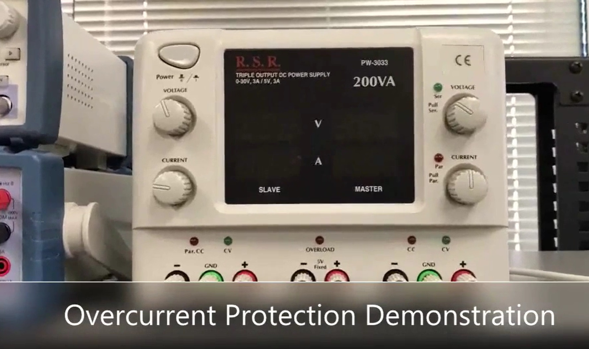](https://nmc.hosted.panopto.com/Panopto/Pages/Viewer.aspx?id=cc6484b8-347b-4750-84fc-ae5a00ca47d3&instance=moodle-production){:target='_blank'}

Watch the following video to learn how to use breadboards

**Breadboards**
[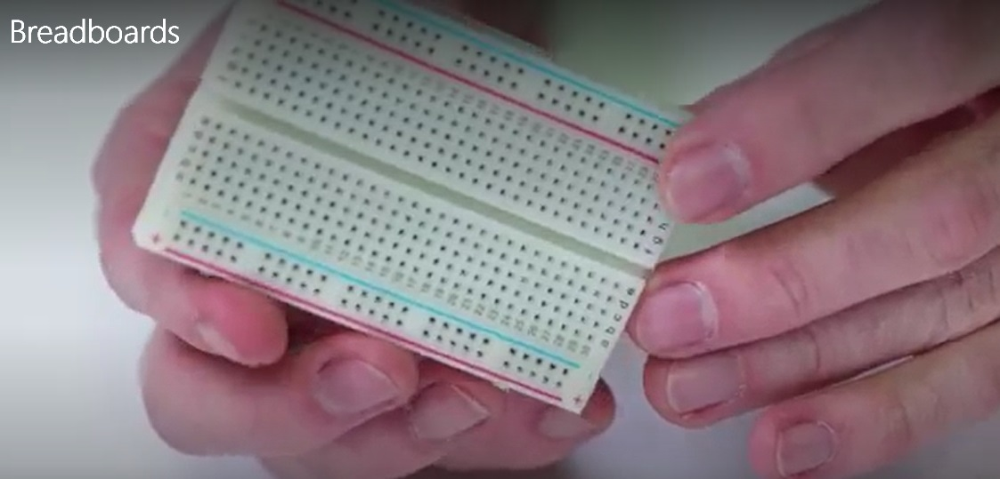](https://nmc.hosted.panopto.com/Panopto/Pages/Viewer.aspx?id=713474b2-26df-4e8d-9f34-ae5a00ca4692&instance=moodle-production){:target='_blank'}
