---
layout: default
---

## EET103 Electrical Studies I

### [EET103](../../) - [Lessons](../) - Sources of Electricity

**What is a circuit?**

An electrical circuit consists of three basic components:

1. Source of electricity
1. Conductor
1. Load

The photograph below (Figure 1) shows a basic electrical circuit. The source of electricity is the battery, the conductors are the red and white wires, and the load is the light bulb. The switch in the circuit is used to apply or remove power from the load.

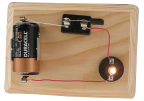

Figure 1: Basic circuit with a switch.

The above circuit is represented in a *schematic diagram*, pictured below (Figure 2). The schematic on the left shows the switch in the *open* position, where current is not allowed to flow to the load, and the schematic on the right shows the switch in the *closed* position. When the switch is closed, the circuit is complete, and electrical current flows from the battery, through the wires to the load, then through the wires and switch, and finally back to the battery. If anything interrupts the flow of electricity, like an open switch or a cut wire, then the circuit is not complete and the current does not flow.

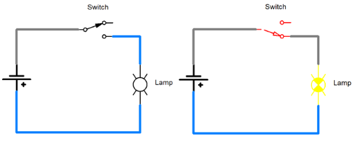

Figure 2: Schematic diagram of the circuit in Figure 1.

**Sources of electricity**
- Chemical
- Light
- Pressure
- Heat
- Magnetism

---

**Chemical Electricity**

Batteries produce electricity through chemical reactions. A battery will have a positive (+) and negative (-) terminal. Batteries are made of cells, each cell generally producing about 1.5 volts (although the voltage per cell varies based on the battery type). A single-cell coin battery is pictured in Figure 3.

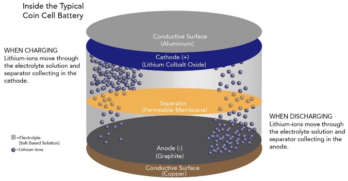

Figure 3: Inside a battery.

The AA battery on the left (Figure 4) is s single cell, and it produces 1.5 volts. The 9-volt battery in the center is actually made of 6 cells, each cell producing 1.5 volts (1.5 volts/cell x 6 cells = 9 volts). The 12-volt A23 battery is made of 8 1.5 volt cells.

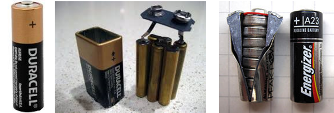

Figure 4: Multiple cells are used to make batteries with higher voltages.

*Question*
How many cells are in the 6-volt battery pictured below?

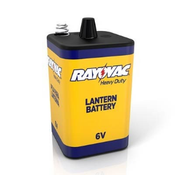

**Answer**

Did you figure out how many cells are in a 6-volt lantern battery?  If you said four, your are correct!

[image of sample battery internals](05_sample_battery_internal.png)

Some batteries are dry-cells, like the ones pictured above. Other batteries are wet-cells, which are filled with a liquid electrolyte. Some batteries are rechargeable, while other batteries are one-time use. The 12-volt car battery pictured in Figure 5 is a wet-cell rechargeable battery that has six cells.

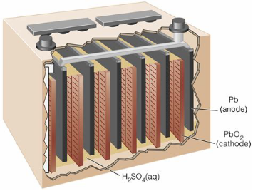

Figure 5: Cutaway of a typical automotive 12-volt battery.

For an inside look at how a cellphone battery is made, watch the following video: 

**How to Make a Cellphone Battery**
[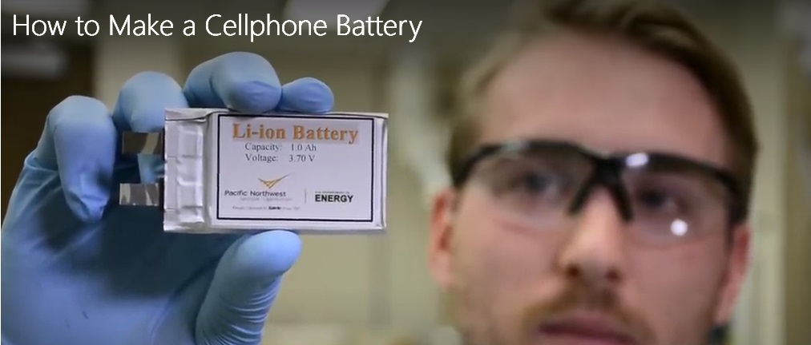](https://nmc.hosted.panopto.com/Panopto/Pages/Viewer.aspx?id=d08bff2d-51d8-4c0a-aee9-ae5a00ca45f2&amp;instance=moodle-production){:target='_blank'}

Watch this video to see how you can make a battery with common household items:

**How to Make a Coin Battery**
[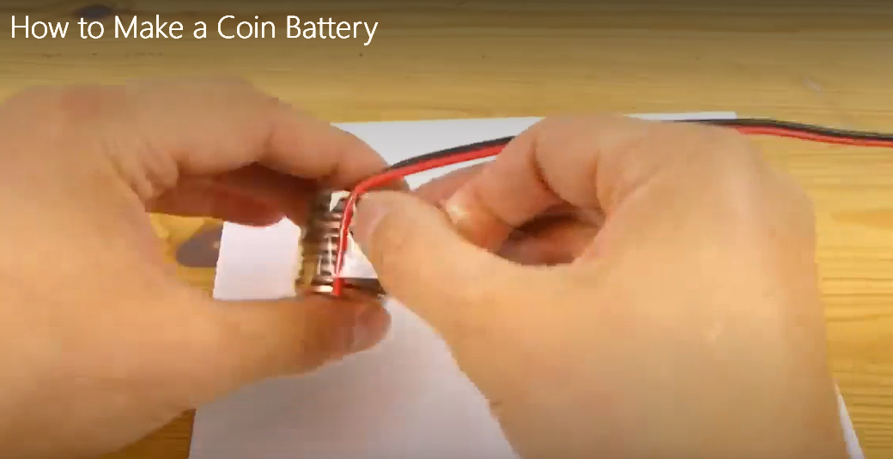](https://nmc.hosted.panopto.com/Panopto/Pages/Viewer.aspx?id=48b0e43e-28be-4e09-a85f-ae5a00ca4551&amp;instance=moodle-production){:target='_blank'}

---
**Electricity from Light**

Solar cells, like the one pictured in Figure 6, produce electrical power from light. Each cell produces approximately 0.5 - 0.6 volts, and many cells are placed in an array to get higher voltages.

Figure 6: Solar cells.

Solar cells are common for powering many devices, like the ones pictured below (Figure 7).

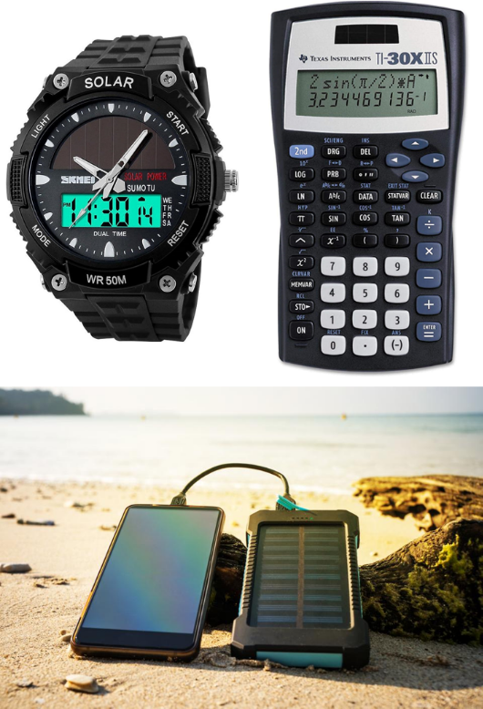

Figure 7: Solar power at work.

**Electricity from Pressure**

Piezoelectric cells will produce electrical energy when they are compressed. Piezoelectric cells can produce electricity from common activities like walking or driving.

[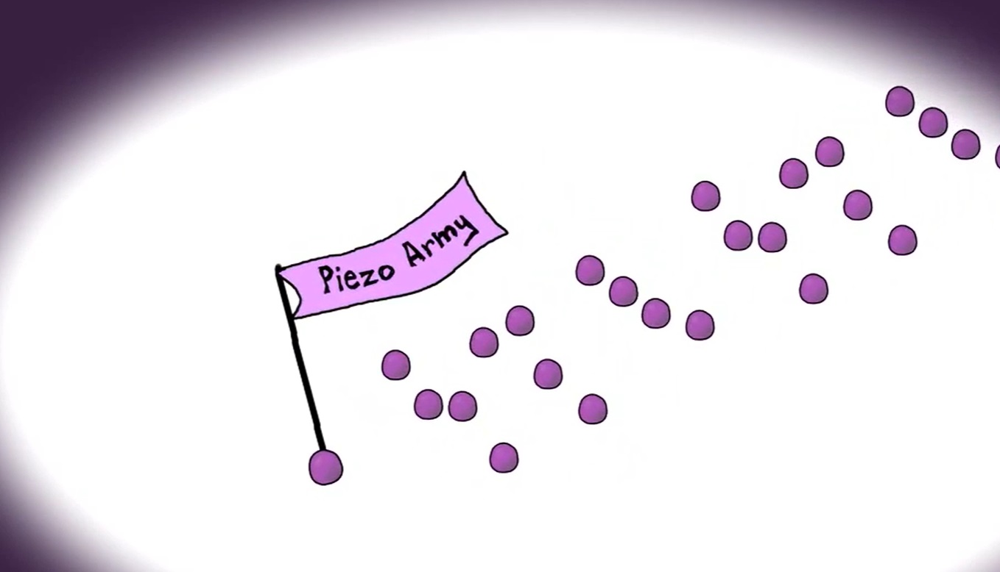](https://nmc.hosted.panopto.com/Panopto/Pages/Viewer.aspx?id=b6491277-1537-4890-8cf4-ae5a00ca44b1&start=0){:target='_blank'}

**Electricity from Heat**
[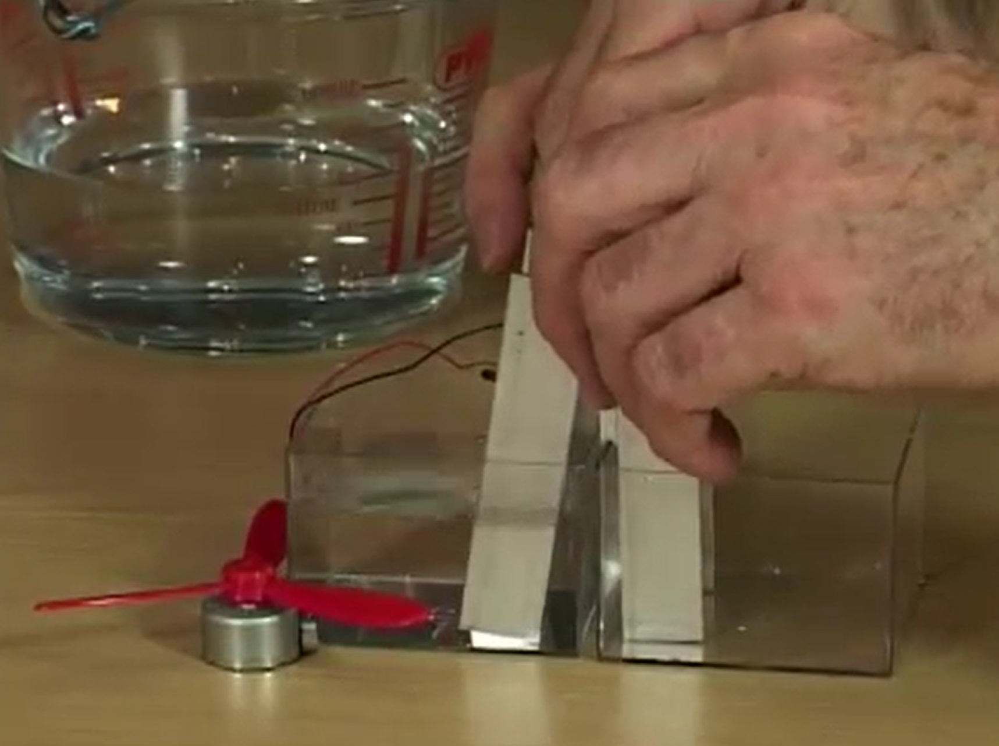](https://nmc.hosted.panopto.com/Panopto/Pages/Viewer.aspx?id=1ac67af4-0745-444c-a6f0-ae5a00ca4411&start=0){:target='_blank'}

**Electricity from Magnetism**

Electrons have a negative charge, and thus are affected by magnetic fields. Moving a magnet past a conductor will induce an electrical current. Electricity from magnetism is another common method to generate electricity from motion.

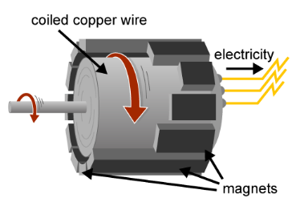

Figure 8: Electricity from magnetism.

**How does an electric eel produce electricity?**

- Which are the positive and negative ends?
- Can you identify the source, conductor, and load?

[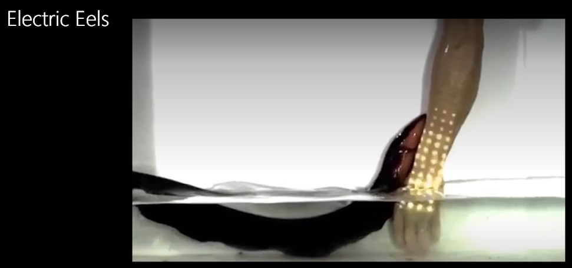](https://nmc.hosted.panopto.com/Panopto/Pages/Viewer.aspx?id=e179d144-d2ad-4a01-868a-ae5a00ca4370&start=98.521398){:target='_blank'}
