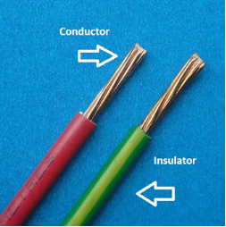
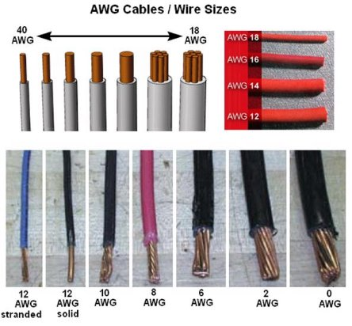
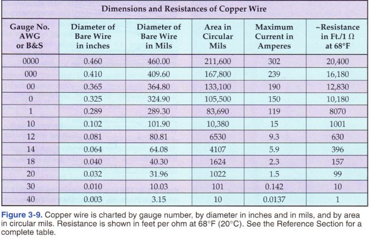
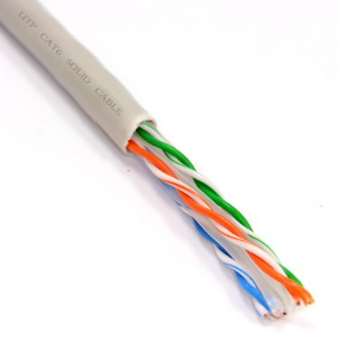


---
layout: default
---

## EET103 Electrical Studies I

### [EET103](../../) - [Lessons](../) - Electrical Conductors

**Objectives:**

- Use the AWG table to select a wire for given application.

Anything that conducts electricity is an electrical conductor. Copper is an excellent conductor of electricity, and copper wires are commonly used in electrical applications.

Figure 1: Stranded wires.

Electrical wires are specified by wire gauge (also known as number). A larger wire gauge number indicates a *thinner* (smaller diameter) wire, while a smaller wire gauge number indicates a *thicker* wire. Some commonly used wire gauges are pictured below (Figure 2).

Figure 2: Wire gauge comparison.

Some wires are *stranded*, which means they are made of a number of smaller wires bundled together. Other wires are *solid*, composed of a single wire. Stranded wires are more flexible, thus are appropriate for applications where the wire will be moved around. The power cord to your cellphone or laptop computer is made of stranded wire. Solid wires are used where the wire is is a fixed location, such as the electrical wires that supply power to the outlets in your home or dorm room.

All electrical conductors, no matter how good they are at conducting electricity, will have a certain amount of opposition or *resistance* to the flow of electricity. This resistance is measured in ohms and uses the symbol Ω (we'll cover more on resistance in future modules). Lower resistance means the wire is a better conductor of electricity, while higher resistance indicates a poor conductor.

The resistance of a wire depends on several factors, including length and gauge. The longer a section of wire is, the more resistance it will have. The image below lists several characteristics of different gauges of copper wires.

Figure 3: AWG Table  *Electricity and Basic Electronics (page 44)*.

As an example, a 12-gauge wire an handle a maximum *current* of 9.3 amperes (or amps for short). W e'll formally cover electrical current in a future lesson, but for now you can think of it as the flow of water through a pipe. A larger diameter wire can handle a greater flow of electrical current, just as a larger diameter pipe allows a greater amount of water to flow through it. Since a 10-gauge wire has a larger diameter, it can handle a larger current, 15 amps. A 0-gauge wire can handle up to 150 amps.

A larger diameter wire also has a lower amount of resistance. Take a look at the right column, where it gives the resistance in Ft/ohms. It takes 630 feet of 12-gauge wire to get 1 ohm of resistance, but the larger diameter 10-gauge wire needs 1001 feet to get 1 ohm of resistance. The 0-gauge wire requires 10,180 feet to get 1 ohm of resistance, almost 2 miles!

Figure 4: Ethernet cable, which uses eight 24-gauge wires.

The ethernet cable used to connect some devices to a computer network uses eight 24-gauge wires (Figure 4). What is the current limit for a 24- gauge wire? Although 24-gauge wire is not listed on the table, you can see that it is between 0.142 amps for the 30-gauge wire and 1.5 amps for the 20-gauge wire. It's designed to carry data, and this doesn't require a lot of power.

Why is there a limit on how much current can flow through a wire? Watch the following video to find out what happens when 100 amps is applied to a 10-gauge wire for 1 minute, then a 12-gauge wire for 1 minute, and finally a 24-gauge wire. The temperature of each wire (degrees C) is measured at the one-minute point.

{:target='_blank'}

Before choosing a wire for your application, be sure that you know the current requirements! 