---
layout: default
---

## EET103 Electrical Studies I

### [EET103](../../) - [Lessons](../) - Switches, Fuses, and Breakers

Objectives

- Understand and describe the operation of switch types, including SPST, SPDT, DPST, and DPDT.
- Describe the operation of fuses and circuit breakers.

#### Switches

When the switch is turned off, the circuit is *open*, and current doesn't flow. This is illustrated in the circuit on the left in Figure 1, below. When the switch is turned on, the circuit is *closed.* Electrical current now flows from the power source through the load, as in the circuit on the right. This is the basic function of an electrical *switch*.

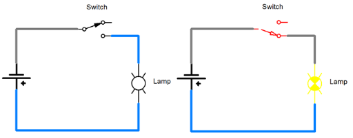

Figure 1: Switch turned off (left) and on (right).

A switch is a mechanical device with electrical *contacts* that can be connected or disconnected through the movement of a lever, or a push button, etc. In the switch pictured above, the part with the arrow on it is known as the *pole*. This switch has a single pole. The contact that the pole connects to is known as the *throw*. The switch pictured above has two throws, but only one of them is being used. Since this switch has a single pole and two throws, it is known as a single-pole, double-throw switch (SPDT for short).

**SPDT Toggle Switch**

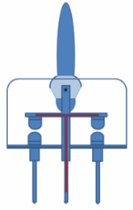

**SPST Push Button Switch**

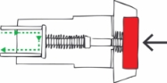

Figure 2: SPDT toggle switch (top) and SPST push button switch (bottom).

Basic switch types include SPST, SPDT, DPST, and DPDT. The symbols used for these switch types are illustrated below. Notice that in the DPST and DPDT switches, the poles are mechanically connected and move together.

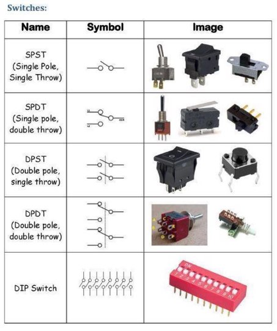

Figure 3: Summary of switch types.

The DIP switch (DIP stands for dual in-line package) is designed to be mounted on a printed circuit board. The DIP switch in the picture has a series of 10 SPST switches that operate independently, and are used to select various settings and functions.

The circuit pictured in Figure 4 illustrates how two SPDT switches can be used to operate a light from two different locations. You may have light switches like this in your home.

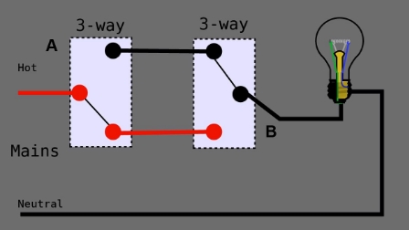

Figure 4: Three-way switch.

A slightly more complicated circuit (pictured below) shows how a DPDT switch can be used to reverse the direction of a DC motor. DC stands for direct current, which is what we get from a battery, where the current flows in one direction. The battery has  **+** and **-** terminals (positive and negative). When these connections are reversed on a DC motor, the motor runs in the opposite direction. The DPD T switch circuit in Figure 5 is a great way to simplify reversing the direction of a motor. See if you can trace the current and understand how it works.

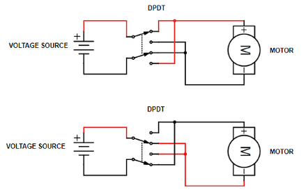

Figure 5: DPDT switch used to control the direction of a DC motor.

**Fuses and Circuit Breakers**

We'll learn more about electrical current (measured in amps) in future lessons. For now, just remember that too much current can be very dangerous. Remember the video where a car battery is shorted with a nail? A *short circuit* means that the two terminals of a power supply are connected with a conductor. The result is a very large current. Here's another video to illustrate the dangers of a short circuit. Warning: This is very dangerous, don't try this on your own!

**Why We Need Fuses!**

[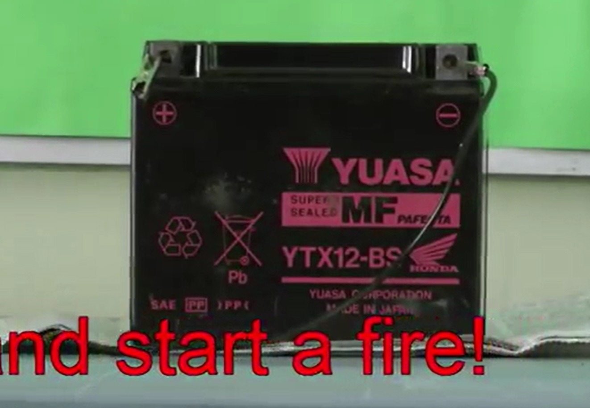](https://nmc.hosted.panopto.com/Panopto/Pages/Viewer.aspx?id=17fab492-0b4b-418a-ba34-ae5a00ca422a&start=0){:target='_blank'}

When the circuit was completed in the video, there was somewhere around 800-1000 amps of current flowing through the nail. This is a LOT of current, and as you saw, the results of a *short circuit* can be very dangerous. Fortunately, there are safety devices to help protect circuits from short circuits or other types of overloads.

A *fuse* or a *circuit breaker* is a device that's designed to operate like a switch. Instead of having a lever, though, the fuse and circuit breakers will *open* when the current exceeds a specified limit, in amps.

#### Fuses

Fuses have a fine wire or filament which is designed to melt if the current exceeds the specified limit. When a fuse "blows' it must be replaced. The picture below shows a typical automotive fuse as as the filament melts.

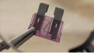    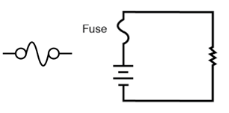

Figure 6: Fuse.

#### Circuit Breakers

[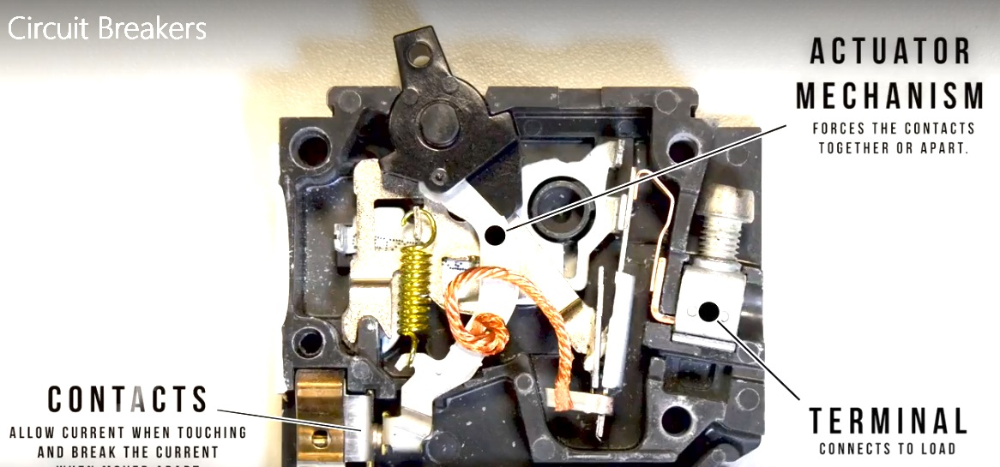](https://nmc.hosted.panopto.com/Panopto/Pages/Viewer.aspx?id=6389aa22-9acf-4e74-9af3-ae5a00ca418a&start=93.324773){:target='_blank'}

A circuit breaker operates just like a fuse, except circuit breakers can be reset like a switch. An airplane electrical panel (Figure 7) shows the 2-amp RL TRIM circuit breaker "popped". To reset the circuit breaker, it simply needs to be pushed back in. Prior to resetting a circuit breaker or changing a fuse, it is *always* a good idea to investigate what caused the overload and fix the problem first!

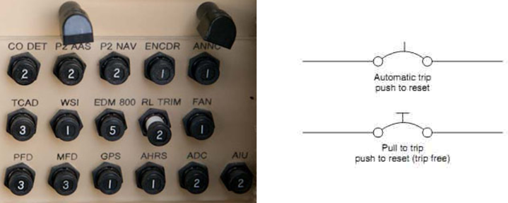

Figure 7: Circuit breaker.

