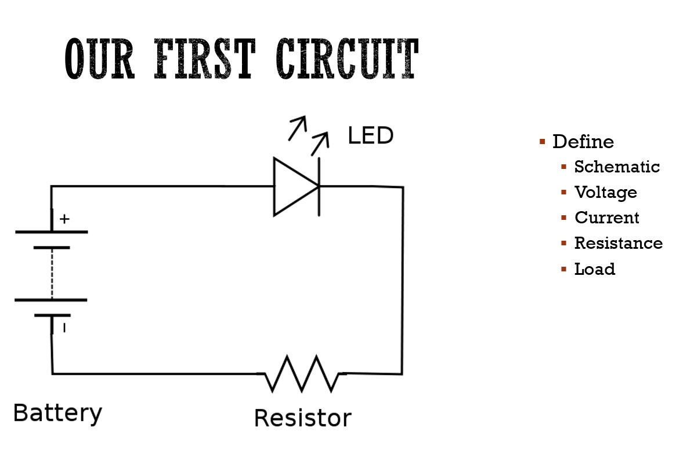
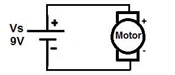

## EET103 Electrical Studies I

### [EET103](../../../) - [Sprint 1](../../) -[Week 1](../) - Session 1

**Session 1**

- Welcome! 
- Instructor
    - Keith E. Kelly
    - kkelly@nmc.edu
    - 231-995-1312 (email is a better option)
- Course site - Moodle  
    - Visit EET 103 Site
    - Course structure - sprints, weeks, sessions, assignments
    - Syllabus
    - Weekly work is always due by Sunday at 11:55 PM. See W01
- Sprint 1 partners
    - Introductions
        - Your name
        - Degree? Major?
        - Prior experience with electricity or electronics?
        - What are your goals for this class?
        - What other classes are you taking?

- Survey of electronics
    - [AI PROMPT] I'm considering a career as an electronics technician. Can you provide an oveview of possible industries or technologies that I should consider?
    - [AI PROMPT] Perfect! Thank you. Can you give me an idea of the annual salaries that are typical in the midwest region?
    - [AI PROMPT] How does a degree in electronics technology differ from an electronics engineering degree?

    
- TOUR OF FACILITIES 
    - NMC Makerspace
        - Mission
            - Zero to maker
            - Maker to maker
            - Maker to entrapreneur
        - Open 8:00 am – 10:00 pm MTWRF
        - Saturdays?
    - PS157A -Other Electronics Lab

- EET103 Student Kit
    - Bill of Materials
    - Kit build activity
    - Kit review
    
- Electronic Circuit - a first look
    - 
    - 

- Our build progression
    - Schematic
    - Simulation
    - Prototyping (may use breadboard - see sprint 2)
    - Printed Circuit Board (PCB)

<!-- - [EveryCircuit simulator](https://everycircuit.com/app){:target='_blank'} -->

- AC VS. DC
    - [AI PROMPT] Please help me understand the difference between AC and DC voltage sources.

- [Basic Concepts of Electricity](https://www.allaboutcircuits.com/textbook/direct-current/chpt-1/static-electricity/){:target='_blank'} 
    - Through electrical continuity
        - open circuit
        - short circuit
        - *Activity* - DVM test of fuse and SPDT toggle switch 

---

### Assignments
- Reading
    - [Basic Concepts of Electricity](https://www.allaboutcircuits.com/textbook/direct-current/chpt-1/static-electricity/){:target='_blank'}
        - Static Electricity
        - Conductors, Insulators, and Electron Flow
        - What Are Electric Circuits?
        - Voltage and Current
        - Resistance
        - Voltage and Current in a Practical Circuit
        - Conventional Versus Electron Flow

