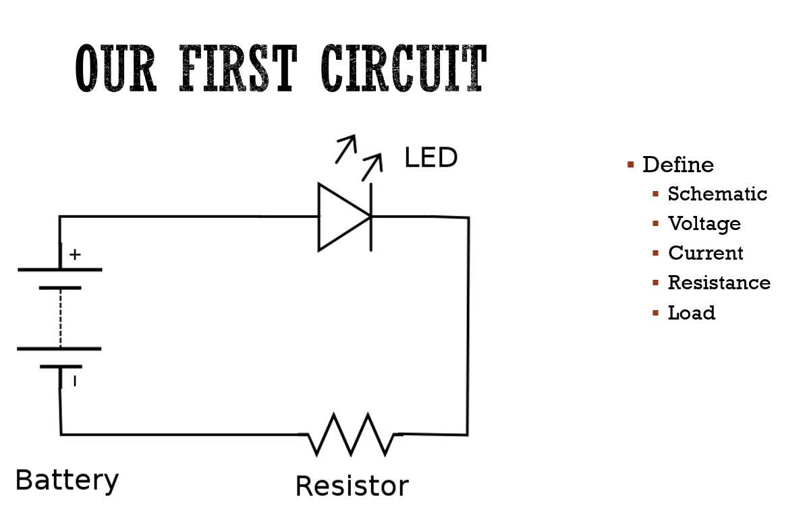
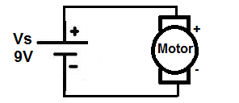

## EET103 Electrical Studies I

### [EET103](../../../) - [Sprint 1](../../) - [Week 1](../) - Session 1

cancelled -- see s2 for start

<!-- 
#### **Session 1**

- Welcome! 
- Instructor
    - Keith E. Kelly
    - kkelly@nmc.edu
    - 231-995-1312 (email is a better option)
- Course site - Canvas  
    - Visit EET 103 Site
        - nmc.edu -> myNMC -> Canvas
    - Course structure (16 weeks)
        - sprints (5)
        - weeks (3 per sprint)
        - sessions (2 per week)
        - assignments - always due by Sunday at 11:59 PM. See W01
        - test and quizzes - in class
    - Syllabus
- Sprint 1 partners
    - Introductions
        - Your name
        - Degree? Major?
        - Prior experience with electricity or electronics?
        - What are your goals for this class?
        - What other classes are you taking?
- Survey of electronics
    - [AI PROMPT] I'm considering a career as an electronics technician. Can you provide an oveview of possible industries or technologies that I should consider?
    - [AI PROMPT] Perfect! Thank you. Can you give me an idea of the annual salaries that are typical in the midwest region?
    - [AI PROMPT] How does a degree in electronics technology differ from an electronics engineering degree?
- TOUR OF FACILITIES 
    - NMC Makerspace
        - Mission
            - Zero to maker
            - Maker to maker
            - Maker to entrapreneur
        - [Schedule](https://calendar.google.com/calendar/u/0/r?cid=Y185azMydGVtNGs5ZXRsMGVqMDQ0a2s5bGV0MEBncm91cC5jYWxlbmRhci5nb29nbGUuY29t)
        - Saturdays?
    - PS157A -Other Electronics Lab

*BREAK*

- EET103 Student Kit
    - [Bill of Materials](../../../hardware_kit/EET103_kit_BOM.pdf)
    - Kit review
    
- Electronic Circuit - a first look
    - 
    - 

- Our build progression
    - Schematic
    - Simulation
    - Prototyping (may use breadboard - see sprint 2)
    - Printed Circuit Board (PCB)

- Review of online text and assigned reading
    - [All About Circuits](https://www.allaboutcircuits.com/textbook/direct-current/){:target='_blank'}
    - [PDF version of text](<../../../resources/All about circuits - DC.pdf>){:target='_blank'}
    - Chapter 1 assigned

- Introduction to video camera and headset use

 -->