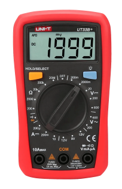

## EET103 Electrical Studies I

### [EET103](../../../) - [Sprint 1](../../) - [Week 1](../) - Session 2

- Announcements	
    - MakerSpace Meta - see Canvas
        - Tech hours
    - Review session recording

### static electricity
- Static Electricity(https://www.allaboutcircuits.com/textbook/direct-current/chpt-1/static-electricity/)
- Concepts of charge    
>>>One pioneering researcher, Benjamin Franklin, came to the conclusion that there was only one fluid exchanged between rubbed objects, and that the two different “charges” were nothing more than either an excess or a deficiency of that one fluid. After experimenting with wax and wool, Franklin suggested that the coarse wool removed some of this invisible fluid from the smooth wax, causing an excess of fluid on the wool and a deficiency of fluid on the wax. The resulting disparity in fluid content between the wool and wax would then cause an attractive force, as the fluid tried to regain its former balance between the two materials.
- Measuring charge
>>>The operational definition of a coulomb as the unit of electrical charge (in terms of force generated between point charges) was found to be equal to an excess or deficiency of about 6,250,000,000,000,000,000 electrons. Or, stated in reverse terms, one electron has a charge of about 0.00000000000000000016 coulombs. Being that one electron is the smallest known carrier of electric charge, this last figure of charge for the electron is defined as the elementary charge
- Additional review
    - [Static Electricity Worksheet](https://www.allaboutcircuits.com/worksheets/static-electricity/){:target='_blank'}
    - [Atomic Structure Worksheet](https://www.allaboutcircuits.com/worksheets/atomic-structure1/){:target='_blank'}

### Conductors, Insulators, and Electron Flow

- [See All About Circuits - Chapter 1](https://www.allaboutcircuits.com/textbook/direct-current/chpt-1/conductors-insulators-electron-flow/){:target='_blank'}

#### Conductors vs Insulators

- [AI Prompt] - Is gold the best conductor? What other options are there?

#### Electron Flow / Electric Current

#### Electrical Continuity
- A first look at the UT33B+ Digital Multimeter (DVM)

- [Lab 01 Testing Continuity](../../../labs/l01_continuity/index.md)

#### Soldering Introduction
- This introduction is contained in the Lab 01 experience

#### Review
- [Conductors-Insulators worksheet](worksheet.md)

