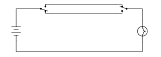
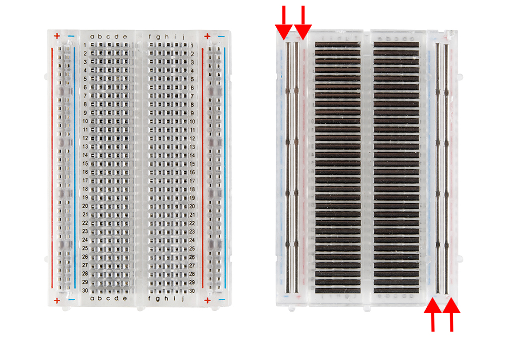

## EET103 Electrical Studies I

### [EET103](../../../) - [Sprint 1](../../) - [Week 3](../) - Session 2

**Session 2**
- Site Review - Sprint 3 requirements - **Due this week**
- Moodle gradebook
    - W01 - none
    - W02 - graded. If you did not submit, include in W03
    - W03 - 3 short videos - Circuit A, B, and C.
        - Review the rubric for requirements
    - Q1 completed, Q2 this evening, Q3 on chapter 3 next week
- Review from Chapter 1
    - Basic switch and continuity

    
    
    - make or break
    - short or open
    - low/high resistance
    - switch is in *series* with the load
    - Use of ground symbols
    - *Poles* and *Throws*
    
    

    - Common three-way switch

    

- [Batteries in Series](https://www.allaboutcircuits.com/textbook/experiments/chpt-3/series-batteries/){:target='blank'}
- [Batterues in Parallel](https://www.allaboutcircuits.com/textbook/experiments/chpt-3/parallel-batteries/){:target='blank'}

- Math for Electronics
    - Scientific notaton and metric prefixes
        - Write the following exponential expressions in expanded form:
            - 101 =
            - 102 =
            - 103 =
            - 104 =
            - 10-1 =
            - 10-2 =
            - 10-3 =
            - 10-4 = 
        - Expressing the answers in expanded form:
            - 3.6 x 102 = 
            - 1.53 x 10-4 =
            - 8.2 x 101 =
            - 6 x 10-3 =
        - **[AI Prompt:]** - What are common metric prefixes that are used in electronic circuits?
        - **[AI Prompt:]** - Please provide sample electronic values using the prefixes provided above.

    - A first look at Ohm's Law (Chapter 2)
        - V = I * R
    - Review meter impedance/resistance along with use.
        - Introduction to the *Breadboard*
        
        

- *BREAK*
- [Quiz 2](https://forms.office.com/r/75ntd09cpd){:target='_blank'}
- Lab 2 continued.

