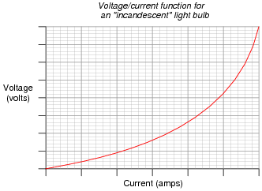
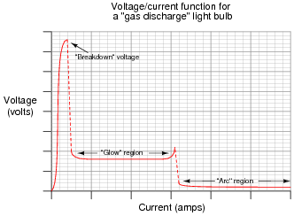

## EET103 Electrical Studies I

### [EET103](../../../) - [Sprint 2](../../) - [Week 4](../) - Session 1

**Session 1**

- Review of Sprint 1
    - [Quiz 1 responses](https://forms.office.com/Pages/DesignPageV2.aspx?origin=NeoPortalPage&subpage=design&collectionid=n11gwqsxu7fopf84cx7kng&id=7d-nLF6sb0SVV1dHONw2EJ6w58fEsdNChe_qBQ1MBUdUOFlCVDlaNFVFWlJHQ1hWVjJGUzEyWlZBMC4u&topview=Presentation){:target='_blank'}
    - [Quiz 2 responses](https://forms.office.com/Pages/DesignPageV2.aspx?origin=NeoPortalPage&subpage=design&collectionid=n11gwqsxu7fopf84cx7kng&id=7d-nLF6sb0SVV1dHONw2EJ6w58fEsdNChe_qBQ1MBUdUMlY0TjgzMEVOVFJOSkRaQ0cyVEtWV0NXUC4u&analysis=false&tab=0&topview=Presentation){:target='_blank'}
    - Reminder: Q3 on safety is next session

- Ohm's Law - Chapter 2
    - [AI Prompt:] - Can you plot this data for me?
        Current	Voltage	
        0.22 A	0.66 V	
        0.47 A	1.42 V	
        0.85 A	2.54 V	
        1.05 A	3.16 V	
        1.50 A	4.51 V	
        1.80 A	5.41 V	
        2.00 A	5.99 V	
        2.51 A	7.49 V	

    - [AI Prompt] - How does this data relate to Ohm's Law?

 One style of light bulb, very different from the ïncandescent” design which works on the principle of a super-heated wire filament emitting light, is called a gas discharge tube. In this design of light bulb, light is produced by the direct ëxcitation” of gas molecules as electric current passes between two electrodes:

Both types of light bulbs have interesting voltage/current plots, neither one being identical to the voltage/current plot of a resistor. First, the voltage/current plot for an incandescent light bulb:

Next, the voltage/current plot for a gas-discharge light bulb:

Based on these two graphs, what can you say about the electrical resistance of each bulb type over its operating range?

IF power dissipation is equal to current times voltage (P = I x V), which lamp is more efficient?

