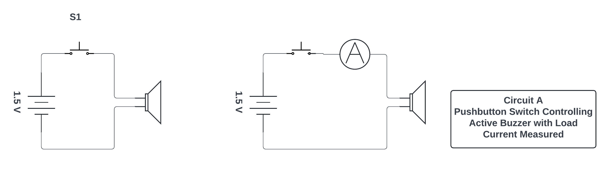

## EET103 Electrical Studies I

### [EET103](../../../) - [Sprint 2](../../) - [Week 4](../) - Session 1

**Session 1**

- Review of Lab 2 - Basic Circuits
    - Circuit A
        - Ammeter measurment
        - Internal resistance of an ammeter?
        - Buzzer as a load - what current did you measure?
        - Other take-aways or thoughts?
    - Circuit B
        - Voltmeter measurement
        - Internal resistance of a voltmeter?
        - Voltage source in series
        - Motor as a load
        - Take-aways? Challenges?
    - Circuit C
        - SPDT toggle to switch loads
        - Load current comparison - Motor vs. Buzzer
        - Total load current if both connected?
        - Load voltage with both connected?
        - Take-aways? Challenges?

- Math for Electronics
    - Scientific notaton and metric prefixes
        - Write the following exponential expressions in expanded form:
            - 101 =
            - 102 =
            - 103 =
            - 104 =
            - 10-1 =
            - 10-2 =
            - 10-3 =
            - 10-4 = 
        - Expressing the answers in expanded form:
            - 3.6 x 102 = 
            - 1.53 x 10-4 =
            - 8.2 x 101 =
            - 6 x 10-3 =
        - **[AI Prompt:]** - What are common metric prefixes that are used in electronic circuits?
        - **[AI Prompt:]** - Please provide sample electronic values using the prefixes provided above.
        
- Resistance and Ohm's Law - [Chapter 2](https://www.allaboutcircuits.com/textbook/direct-current/chpt-2/voltage-current-resistance-relate/){:target='_blank'}

    - [How Voltage, Current, and Resistance Relate](https://www.allaboutcircuits.com/textbook/direct-current/chpt-2/voltage-current-resistance-relate/){:target='_blank'}
    
    - [Power in Electric Circuits](https://www.allaboutcircuits.com/textbook/direct-current/chpt-2/power-electric-circuits/){:target='_blank'}

    - [AI Prompt:] - Can you plot this data for me?

        | Current	| Voltage |
        |-----------|---------|	
        | 0.22 A    |	0.66 V |	
        | 0.47 A    |	1.42 V |	
        | 0.85 A    |	2.54 V |	
        | 1.05 A    |	3.16 V |	
        | 1.50 A    |	4.51 V |	
        | 1.80 A    |	5.41 V |	
        | 2.00 A    |	5.99 V |	
        | 2.51 A    |	7.49 V |	

    - [AI Prompt] - How does this data relate to Ohm's Law?

    - If power is voltage times current **P = V x R** or the square of the current times the resistance **P = I^2 R** then what is happening to power dissipation in the generated graph?

    - [AI Prompt:] - Can you plot power for this resistor given the current in the graph?

    - [Nonlinear Conduction](https://www.allaboutcircuits.com/textbook/direct-current/chpt-2/nonlinear-conduction/){:target='_blank'}

        - One style of light bulb, very different from the ïncandescent” design which works on the principle of a super-heated wire filament emitting light, is called a gas discharge tube. In this design of light bulb, light is produced by the direct ëxcitation” of gas molecules as electric current passes between two electrodes:

            

        - Both types of light bulbs have interesting voltage/current plots, neither one being identical to the voltage/current plot of a resistor. First, the voltage/current plot for an incandescent light bulb:

        

        - Next, the voltage/current plot for a gas-discharge light bulb:

        

        - Based on these two graphs, what can you say about the electrical resistance of each bulb type over its operating range?

        - Given what you know about power dissipation,which lamp is more efficient?

- [Lab 3 - Series Circuits](../../../labs/l03_series_circuits/){:target='_blank'}
    - Introduction/review
    - Partners assigned
    - Due this week

