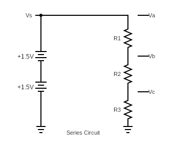
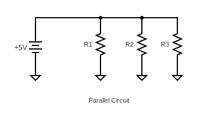
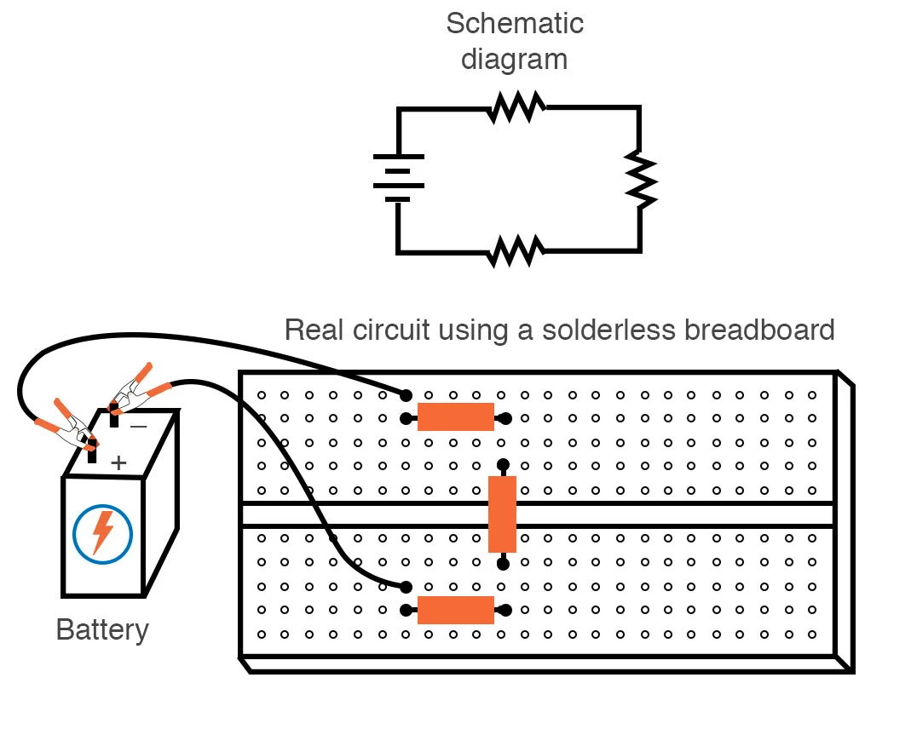
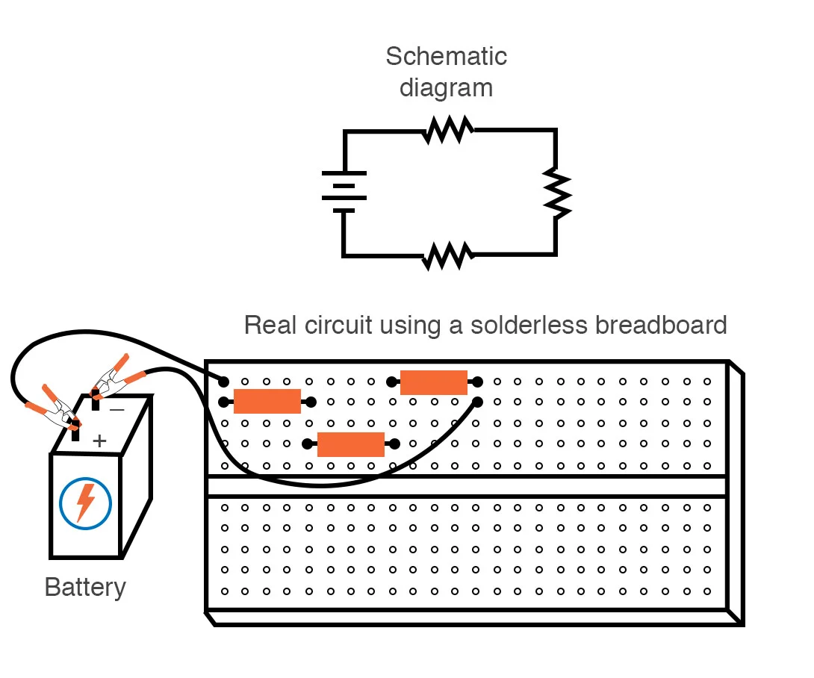
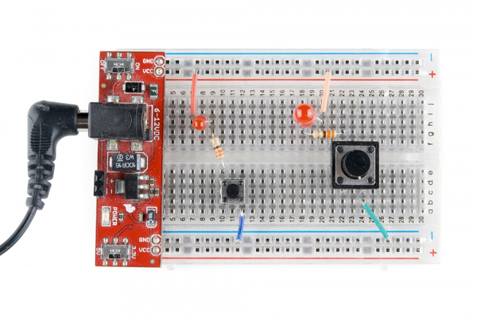

## EET103 Electrical Studies I

### [EET103](../../../) - [Sprint 2](../../) - [Week 4](../) - Session 2

**Session 2**

- Review of Circuits
    - Series Circuit (Lab 3)

    

    - Parallel Circuit (Lab 4)

    

- Series Circuit - circuit analysis
    - Relation of source voltage to load voltage
    - Current in a series circuit
    - Total resistance in a series ciruit

    V = I x R

    RT = R1 + R2 + R3

    VS = VR1 + VR2 + VR3

- Lab 3 example series circuit analysis
    - Given your three resistors calculate current and voltage drops.
        - Lab uses 100 Ω, 220 Ω, 330 Ω
        - Instructor demo - 9 volts with 1 kΩ, 3.3 kΩ, 4.7 kΩ in series
            - I = 
            - VA =
            - VB =
            - VC =
            - VAB =
            - VBC =
            - VAC =
            - VCB = 

- Scientific Calculator Application 
    - RealCalc - Android Apps on Google Play 
    - Panecal Scientific Calculator on the App Store (apple.com)

- Lab 3 simulation
    - Simulator available at: [https://everycircuit.com/app](https://everycircuit.com/app){:target='_blank'}
    - See Lab 3 document for account creation and License key (561036398965)  

 - Lab 3 - Breadboard construction

    

    

- Using power and ground rails on breadboad with your Breadboard Power Supply.
    - [How to Use a Breadboard](https://learn.sparkfun.com/tutorials/how-to-use-a-breadboard/all){:target='_blank'}

    

- *** **BREAK** ***

- [Quiz 2](https://forms.office.com/r/75ntd09cpd){:target='_blank'}

- [Lab 3 - Series Circuits](../../../labs/l03_series_circuits/){:target='_blank'}
    - **Partners assigned**
    - Due next week

