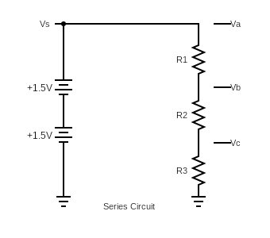
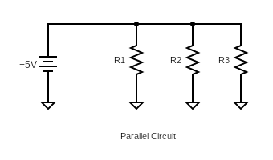
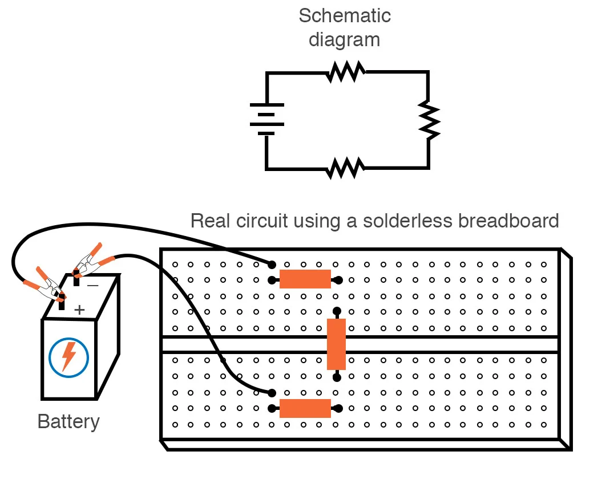
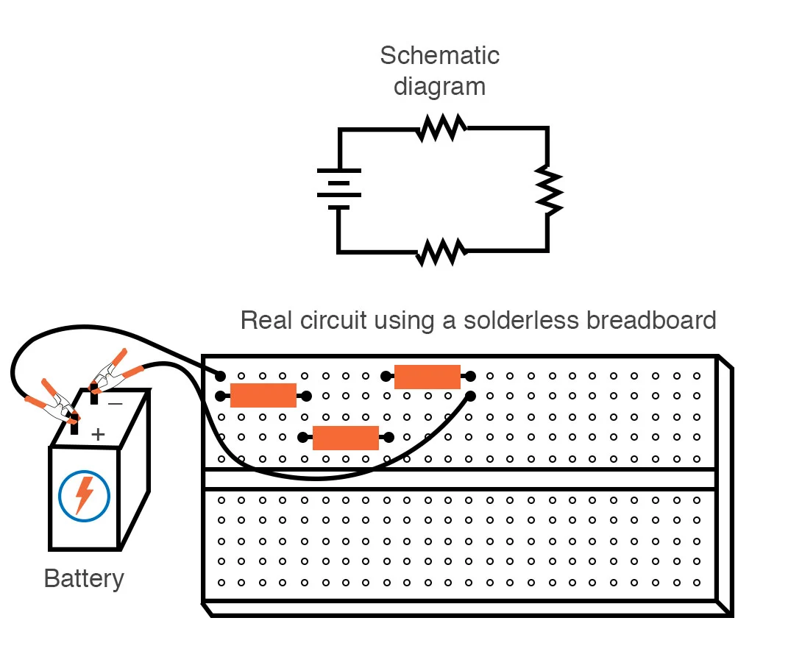
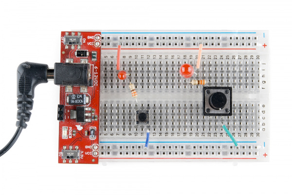

## EET103 Electrical Studies I

### [EET103](../../../) - [Sprint 2](../../) - [Week 4](../) - Session 2

**Session 2**

- Review of Circuits
    - Series Circuit (Lab 3)

    

    - Parallel Circuit (Lab 4)

    

- Series Circuit - circuit analysis
    - Relation of source voltage to load voltage
    - Current in a series circuit
    - Total resistance in a series ciruit

    V = I x R

    RT = R1 + R2 + R3

    VS = VR1 + VR2 + VR3

- Lab 3 example series circuit analysis
    - Given your three resistors calculate current and voltage drops.

Scientific Calculator Application 
o RealCalc - Android Apps on Google Play 
o Panecal Scientific Calculator on the App Store (apple.com)

 - Lab 3 - Breadboard construction

    

    

- Using power and ground rails on breadboad with your Breadboard Power Supply.
    - [How to Use a Breadboard](https://learn.sparkfun.com/tutorials/how-to-use-a-breadboard/all){:target='_blank'}

    

- [Lab 3 - Series Circuits](../../../labs/l03_series_circuits/){:target='_blank'}
    - Partners assigned
    - Due this week

