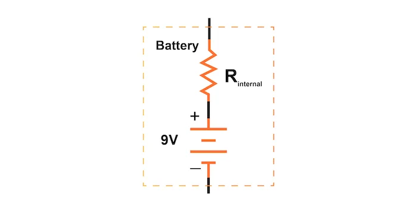
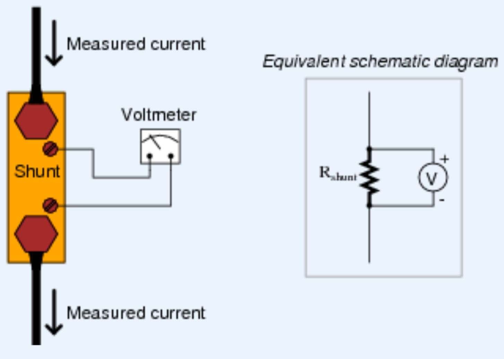

## EET103 Electrical Studies I

### [EET103](../../../) - [Sprint 2](../../) - [Week 5](../) - Session 1

**Session 1**
- Lab 2 Review 
    - Circuit A - Measuring current using a ammeter
    - Circuit B - Loaded voltage sources
    - Circuit C - What is IT with both loads connected?

- Quiz 2 makeup - today!
- Quiz 3:Safety - Wednesday, Session 2

    - [The Importance of Electrical Safety](https://www.allaboutcircuits.com/textbook/direct-current/chpt-3/importance-electrical-safety/){:target='_blank'}
        - The Importance of Electrical Safety
        - Physiological Effects of Electricity
        - Shock Current Path
        - Ohm’s Law (again!)
        - Safe Practices
        - Emergency Response
        - Common Sources of Hazard
        - Safe Circuit Design
        - Safe Meter Usage
        - Electric Shock Data

- More Series Circuits
    - Circuit Analysis Review
        - VT, IT, RT, V1, V2, V3
        - Circuits Analysis calculations required on Midterm (Week 08?)
    
    - Lab 3 review
        - what if series circuit opened?
        - what is the voltage drop on a resistor if circuit is open?
        - what if incorrect R value selected? 470K?

    - Additional review
        1. Flashlight Circuit (Cells in Series + Lamp)
            - 3×AA batteries (1.5 V each) in series → 4.5 V total
            - Internal resistance: 0.2 Ω per cell → 0.6 Ω total  
            - Lamp: ~20 Ω
   

        2. Voltage Divider (Scaling 12 V to ~3.3 V)
            - R1 = 26.7 kΩ, R2 = 10 kΩ
            - Divider ratio: Vout = Vin × (R2 / (R1+R2))

        3. Two LEDs in Series + Resistor
            - Supply: 9 V battery
            - LEDs: 2× red (Vf ≈ 2.0 V each)
            - If = 15 mA
            - What is the value of current limiting R?

  
<!-- - DC Motor as a Load - revisited
    - Connect three 1.5V batteries in series
    - Use the larger SPDT switch provided to connect this source to the motor. Use you DMM to determine the switch pin out and be sure the switch is in the *OFF* position when connecting.
    - With a partner discuss the source and the load.
        - What assumptions can you make about the load current that will be drawn from the source when you energize the circuit. 
        - What assumptions can you make about the source voltage when the load is energized?
    - Using your DMM, measure the load current when the circuit is energized.
    - Using your DMM, measure the terminal voltage of the source when the circuit is energized.
    - Calculate the power dissipation of the load.
    - Why did the terminal voltage drop?
    >[AI Prompt:] - We are observing voltage drops in a series of 1.5V batteries during our experiment. Can you explain the basic model of a DC battery, including how the internal resistance (Rs) affects the output voltage? Please provide a simple circuit model and discuss how internal resistance impacts the performance, especially under load conditions.

- Use a shunt to measure load current.

    - Inspect the resistor provided by the instructor.
    - Use the guide in your kit to determine the resistance value.
    - What is the tolerance rating?
    - Measure the actual value with your ohmmeter.
    - Based on the size, what assumption can you make about the power rating of this device?
    - Place the resistor in series with the motor load. Consider this a shunt resistor. 
    - Measure the voltage drop across the resistor and determine the load current.
    - Does inserting this shunt resistor change the circuit? What improvements could be made?
     -->

- Next session  
    - **[Worksheet 1 - Ohm's Law](https://forms.office.com/Pages/ResponsePage.aspx?id=7d-nLF6sb0SVV1dHONw2EJ6w58fEsdNChe_qBQ1MBUdUOTBQMTg1MUVSTFlRUEJPVDY0UTZLUktWQS4u){:target='_blank'}** - prep for Quiz 4
        - Due this week
        
    - Parallel circuits - an introduction

- Lab 3 - status? issues?

- *** **BREAK** ***

Working time: - [Lab 3 - Series Circuits](../../../labs/l03_series_circuits/){:target='_blank'}

