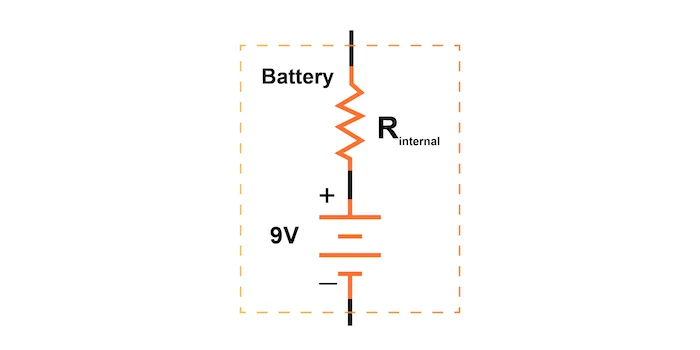

## EET103 Electrical Studies I

### [EET103](../../../) - [Sprint 2](../../) - [Week 5](../) - Session 1

**Session 1**
- Lab 2 Review 
    - Circuit A - Measuring current using a ammeter
        - Motor draw with 3 x 1.5V?
    - Circuit B - Loaded voltage sources    

    - Circuit C - What is IT with both loads connected?

- Series review

- Parallel Intro

Next session 
- worksheet
- Quix on ohm's

Quiz

Lab

