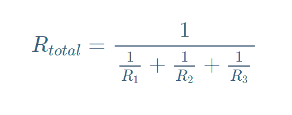

## EET103 Electrical Studies I

### [EET103](../../../) - [Sprint 2](../../) - [Week 5](../) - Session 2

**Session 2**

*** quiz 2 review **

- [Parallel Circuits](https://www.allaboutcircuits.com/textbook/direct-current/chpt-5/simple-parallel-circuits/){:target='_blank'}
    - Voltage is the same across each branch (Current was the same in Series)
    - Total current is the sum of branch currents (Total voltage waas the sum of voltage drops in Series)
    - Total power is sum of individual power (same in Series)
    - Total resistance in parallel
        - Less than any individual branch
        - Yes, this works...

        

        - but, I prefer product-over-the-sum. *(only works for two resistors)*

        

        - What is the total R of two 1K in parallel?
        - What is the total R of three 1K in parallel?     

- [Solving with the Table Method and Ohm's Law](https://www.allaboutcircuits.com/textbook/direct-current/chpt-5/solving-series-and-parallel-circuits-with-the-table-method-and-ohms-law/){:target='_blank'}
- [Power in Series and Parallel](https://www.allaboutcircuits.com/textbook/direct-current/chpt-5/power-calculations/){:target='_blank'}

BREAK

- [Quiz 4 (Ohm's Law)](https://forms.office.com/Pages/ResponsePage.aspx?id=7d-nLF6sb0SVV1dHONw2EJ6w58fEsdNChe_qBQ1MBUdUNUY1M0ZMWlVMQ0M1U1NIMkZaU0JHMlUzMy4u){:target='_blank'}

- [Lab 4 - Parallel Circuits](../../labs/l04_parallel_circuits/){:target='_blank'} with associated Zoom video

