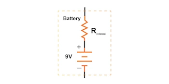
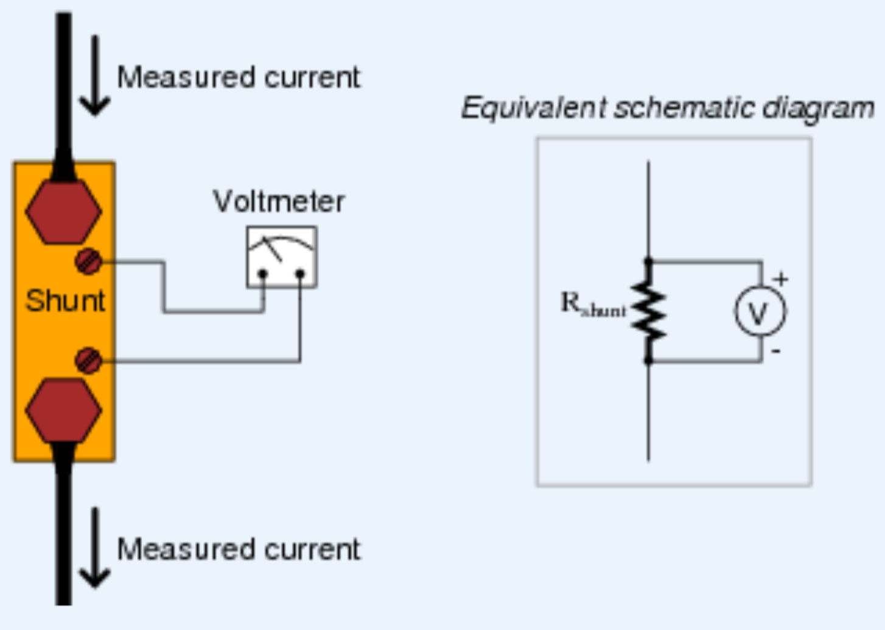
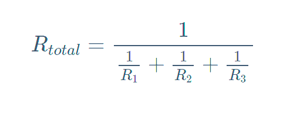

## EET103 Electrical Studies I

### [EET103](../../../) - [Sprint 2](../../) - [Week 5](../) - Session 2

**Session 2**

- Session 2 outline
    - Review Quiz 2
    - More series examples
        - Battery with Rs and lamp
        - LED's with current limit resisor
        - Motor with shunt
    - Introduction to Parallel and Lab 4.
    - Quiz 3 - Safety
    - What's due?
        - Lab 3 - Series
        - Quiz 3 - in-class
        - Worksheet 1

- Quiz 2 review(https://forms.office.com/Pages/DesignPageV2.aspx?origin=NeoPortalPage&subpage=design&collectionid=n11gwqsxu7fopf84cx7kng&id=7d-nLF6sb0SVV1dHONw2EJ6w58fEsdNChe_qBQ1MBUdUMlY0TjgzMEVOVFJOSkRaQ0cyVEtWV0NXUC4u&topview=Presentation){:target='_blank'}

- Additional Series review
    1. Flashlight Circuit (Cells in Series + Lamp)
        - 3×AA batteries (1.5 V each) in series → 4.5 V total
        - Internal resistance: 0.2 Ω per cell → 0.6 Ω total  
        - Lamp: ~20 Ω

    2. Two LEDs in Series + Resistor
        - Supply: 9 V battery
        - LEDs: 2× red (Vf ≈ 2.0 V each)
        - If = 15 mA
        - What is the value of current limiting R?

- Use a shunt to measure load current.

    - Inspect the power resistor provided by the instructor.
    - Measure the actual value with your ohmmeter.
    - Based on the size, what assumption can you make about the power rating of this device?
    - Place the resistor in series with the motor load. Consider this a shunt resistor. 
    - Apply 9V (or 5V is 9V is not available). Measure the voltage drop across the resistor and determine the load current.
    - Does inserting this shunt resistor change the circuit? What improvements could be made?

- [Parallel Circuits](https://www.allaboutcircuits.com/textbook/direct-current/chpt-5/simple-parallel-circuits/){:target='_blank'}
    - Voltage is the same across each branch (Current was the same in Series)
    - Total current is the sum of branch currents (Total voltage was the sum of voltage drops in Series)
    - Total power is sum of individual power (same in Series)
    - Total resistance in parallel
        - Less than any individual branch
        - Yes, this works...

        

        - but, I prefer product-over-the-sum. *(only works for two resistors)*

        

        - What is the total R of two 1K in parallel?
        - What is the total R of three 1K in parallel?

- Introduction: [Lab 4 - Parallel Circuits](../../labs/l04_parallel_circuits/){:target='_blank'} (due next week)    

***** BREAK *****

- **Complete [Quiz 3: Safety (session 2)](https://forms.office.com/r/mT2B9DgxZw){:target='_blank'}**

- Work time - Complete Lab 3, Start Lab 4.

<!-- - [Solving with the Table Method and Ohm's Law](https://www.allaboutcircuits.com/textbook/direct-current/chpt-5/solving-series-and-parallel-circuits-with-the-table-method-and-ohms-law/){:target='_blank'}
- [Power in Series and Parallel](https://www.allaboutcircuits.com/textbook/direct-current/chpt-5/power-calculations/){:target='_blank'} -->

<!-- - [Quiz 4 (Ohm's Law)](https://forms.office.com/Pages/ResponsePage.aspx?id=7d-nLF6sb0SVV1dHONw2EJ6w58fEsdNChe_qBQ1MBUdUNUY1M0ZMWlVMQ0M1U1NIMkZaU0JHMlUzMy4u){:target='_blank'}

{:target='_blank'} with associated Zoom video -->

