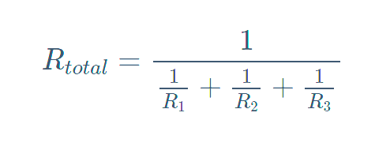
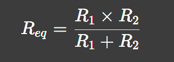

## EET103 Electrical Studies I

### [EET103](../../../) - [Sprint 2](../../) - [Week 6](../) - Session 1

**Session 1**

- Grading
    - Week 6 is end of Sprint 2
    - Due last week
        - Lab 3 Series
        - Quiz 3 Safety
        - Worksheet 1 - Ohm's
    - Midterm alerts issued this week
    - Lab 4: Parallel due this week
    - Quiz 4 (Ohm's Law) this week - session 2
    - Gradebook review
        - Missing Zoom content - check Zoom Trash
        - Grade of 1 - flag for resubmit/regrade
            - Submit for full credit
        - Grade of 0 - missing
            - Submit for late credit
- Looking ahead
    - Week 7: Series-Parallel
    - Week 8: Midterm review
    - Week 9: Midterm and Build/Solder project

- [Quiz 3 review](https://forms.office.com/Pages/DesignPageV2.aspx?origin=NeoPortalPage&subpage=design&collectionid=n11gwqsxu7fopf84cx7kng&id=7d-nLF6sb0SVV1dHONw2EJ6w58fEsdNChe_qBQ1MBUdUNks0S1ZUS08yVFhBN0cySFJFVEJNWkxYTi4u){:target='_blank'}

- [Worksheet 1 review](https://forms.office.com/Pages/DesignPageV2.aspx?origin=NeoPortalPage&subpage=design&collectionid=n11gwqsxu7fopf84cx7kng&id=7d-nLF6sb0SVV1dHONw2EJ6w58fEsdNChe_qBQ1MBUdUOTBQMTg1MUVSTFlRUEJPVDY0UTZLUktWQS4u){:target='_blank'}

- [Parallel Circuits](https://www.allaboutcircuits.com/textbook/direct-current/chpt-5/simple-parallel-circuits/){:target='_blank'}
    - Voltage is the same across each branch (Current was the same in Series)
    - Total current is the sum of branch currents - *KCL*
        - (*KVL* - Total voltage was the sum of voltage drops in Series)
    - Total power is sum of individual power (same in Series)
    - Total resistance in parallel
        - Less than any individual branch
        - Yes, this works...

        

        - but, I prefer product-over-the-sum. *(only works for two resistors)*

        

        - What is the total R of two 1K in parallel?
        - What is the total R of three 1K in parallel?     

- [Solving with the Table Method and Ohm's Law](https://www.allaboutcircuits.com/textbook/direct-current/chpt-5/solving-series-and-parallel-circuits-with-the-table-method-and-ohms-law/){:target='_blank'}

- [Power in Series and Parallel](https://www.allaboutcircuits.com/textbook/direct-current/chpt-5/power-calculations/){:target='_blank'}

- Review [Lab 4 - Parallel Circuits](../../../labs/l04_parallel_circuits/){:target='_blank'} with associated Zoom video

