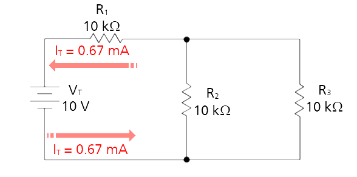
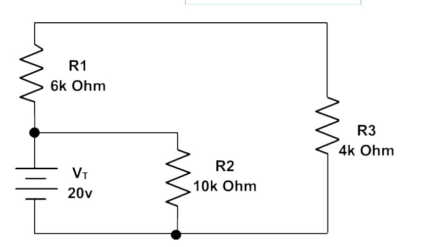

## EET103 Electrical Studies I

### [EET103](../../../) - [Sprint 2](../../) - [Week 6](../) - Session 1

**Session 1**

- Grading
    - Sprint 2 finalized
    - Lab 4 and Quiz 4 graded
    - See gradebook for current percentage/grade

- Schedule
    - Week 07 
        - Series-parallel combination circuits
        - Series-parallel circuit construction
        - Quiz 5 Series circuits on Wednesday
    - Week 08 
        - Midterm review
        - Build/soldering project
        - Quiz 6 Parallel
    - Week 09
        - Midterm is Monday, Oct 20

- Quiz 4 Review

- Lab 4 discussion
    - Current measurement using kit meter
    - Intro to lab bench
    - Power dissipation through 100 ohm resistor?
    
- [Lab 5 - Stop Light Breadboard](../../../labs/l05_stop_light_breadboard/index.md){:target='_blank'} is assigned for this week. 
- Lab 6 - Stop Light Perfboard is next week.
- Readings
    - [Divider Circuits And Kirchhoff's Laws](https://www.allaboutcircuits.com/textbook/direct-current/chpt-6/voltage-divider-circuits/){:target='_blank'}
    - [Series-parallel Combination Circuits](https://www.allaboutcircuits.com/textbook/direct-current/chpt-7/what-is-a-series-parallel-circuit/){:target='_blank'}

- Series-Parallel circuit Analysis
    - See this lesson. We'll discuss the application of KVL and KCL on Wednesday
    - [Series-Parallel DC Circuits Analysis](https://www.wisc-online.com/learn/technical/electronics-dc/dce10504/series-parallel-dc-circuits-analysis){:target='_blank'}
- Practice circuits analysis problems in preparation for Midterm. See links on Week 07 page.
    - Example 1
    
    - Example 2
    

    - [Example problem](https://www.wisc-online.com/learn/technical/electronics-dc/dce11404/series-parallel-circuit-analysis-practice-pro){:target='_blank'}

- [Midterm Exam Specification](../midterm_exam_spec.md){:target='_blank'}

BREAK

- [Lab 5 - Stop Light Breadboard](../../../labs/l05_stop_light_breadboard/index.md){:target='_blank'} 

       
