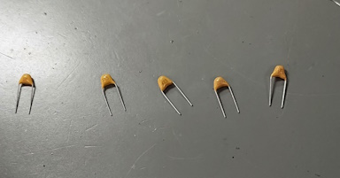
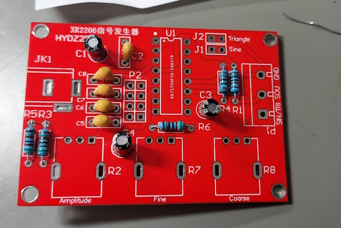
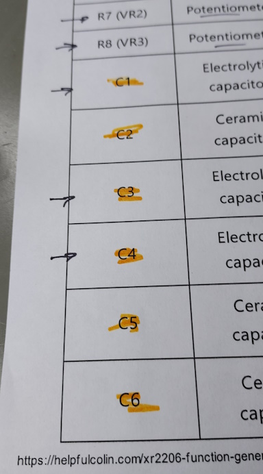
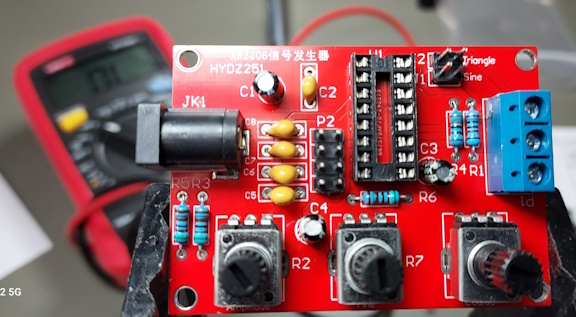
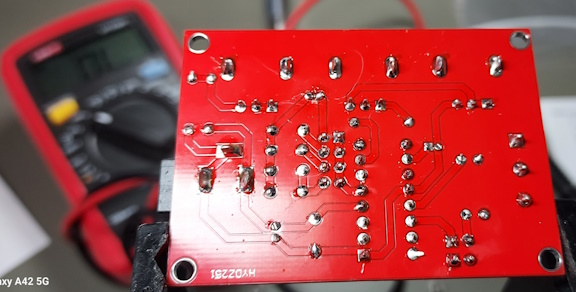

## EET103 Electrical Studies I

### Signal Generator "stuffing" or populating the board

1. Identifying nonpolarized capacitors

2. Resistors and Capacitors placed

3. Component installation checklist

4. Board completed

5. Soldering completed

