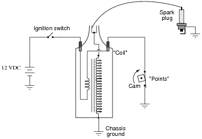

## EET103 Electrical Studies I

### [EET103](../../../) - [Sprint 5](../../) - [Week 14](../) - Session 1

**Session 1**

- [Transformer theory - mutual inductance](
https://www.allaboutcircuits.com/textbook/alternating-current/chpt-9/mutual-inductance-and-basic-operation/){:target='_blank'}

    - similar to resitance/Ohm's Law
    - mmf - magnetizing force proportional to number of turns
    - inductive coupling - primary and secondary coils
    - losses - hysteresis and eddy currents

- [Transformers - Step Up/Step Down](https://www.allaboutcircuits.com/textbook/alternating-current/chpt-9/step-up-and-step-down-transformers/){:target='_blank'}
    - Power in = Power Out
    - Step Up
    - Step Down

- [Problems 1 - 7](https://www.allaboutcircuits.com/worksheets/step-up-step-down-and-isolation-transformers/){:target='_blank'} 

